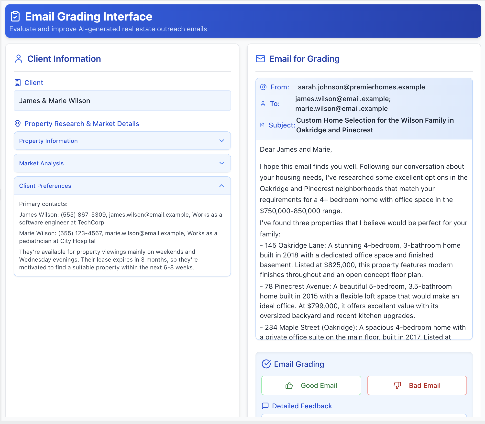
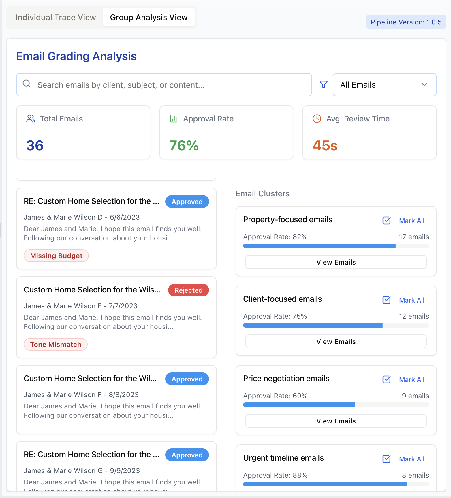

This document curates the most common questions Shreya and I received while [teaching](https://bit.ly/evals-ai){target="_blank"} 700+ engineers & PMs AI Evals.  _Warning: These are sharp opinions about what works in most cases.  They are not universal truths. Use your judgment._

 
<strong>👉 <em>Check out our [AI Evals course](https://bit.ly/evals-ai){target="_blank"}</strong>. Here is a [25% discount code](https://bit.ly/evals-ai){target="_blank"} for readers.</em> 👈

## Q: What are LLM Evals?

If you are **completely new** to product-specific LLM evals (not foundation model benchmarks), see these posts: [part 1](https://hamel.dev/evals), [part 2](https://hamel.dev/llm-judge/), [part 3](https://hamel.dev/field-guide).  Otherwise, keep reading.

## Q: Is RAG dead?

Question: Should I avoid using RAG for my AI application after reading that ["RAG is dead"](https://pashpashpash.substack.com/p/why-i-no-longer-recommend-rag-for) for coding agents?

> Many developers are confused about when and how to use RAG after reading articles claiming "RAG is dead." Understanding what RAG actually means versus the narrow marketing definitions will help you make better architectural decisions for your AI applications.

The viral article claiming RAG is dead specifically argues against using *naive vector database retrieval* for autonomous coding agents, not RAG as a whole. This is a crucial distinction that many developers miss due to misleading marketing.

RAG simply means Retrieval-Augmented Generation - using retrieval to provide relevant context that improves your model's output. The core principle remains essential: your LLM needs the right context to generate accurate answers. The question isn't whether to use retrieval, but how to retrieve effectively.

For coding applications, naive vector similarity search often fails because code relationships are complex and contextual. Instead of abandoning retrieval entirely, modern coding assistants like Claude Code [still uses retrieval](https://x.com/pashmerepat/status/1926717705660375463?s=46) —they just employ agentic search instead of relying solely on vector databases, similar to how human developers work.

You have multiple retrieval strategies available, ranging from simple keyword matching to embedding similarity to LLM-powered relevance filtering. The optimal approach depends on your specific use case, data characteristics, and performance requirements. Many production systems combine multiple strategies or use multi-hop retrieval guided by LLM agents.

Unfortunately, "RAG" has become a buzzword with no shared definition. Some people use it to mean any retrieval system, others restrict it to vector databases. Focus on the ultimate goal: getting your LLM the context it needs to succeed. Whether that's through vector search, agentic exploration, or hybrid approaches is a product and engineering decision.

Rather than following categorical advice to avoid or embrace RAG, experiment with different retrieval approaches and measure what works best for your application.

## Q: Can I use the same model for both the main task and evaluation? 

For LLM-as-Judge selection, using the same model is usually fine because the judge is doing a different task than your main LLM pipeline. The judges we recommend building do [scoped binary classification tasks](#q-why-do-you-recommend-binary-passfail-evaluations-instead-of-1-5-ratings-likert-scales). Focus on achieving high True Positive Rate (TPR) and True Negative Rate (TNR) with your judge on a held out labeled test set rather than avoiding the same model family.  You can use these metrics on the test set to understand how well your judge is doing.

When selecting judge models, start with the most capable models available to establish strong alignment with human judgments. You can optimize for cost later once you've established reliable evaluation criteria. We do not recommend using the same model for open ended preferences or response quality (but we don't recommend building judges this way in the first place!).

## Q: How much time should I spend on model selection?

Many developers fixate on model selection as the primary way to improve their LLM applications. Start with error analysis to understand your failure modes before considering model switching. As Hamel noted in office hours, "I suggest not thinking of switching model as the main axes of how to improve your system off the bat without evidence. Does error analysis suggest that your model is the problem?"

## Q: Should I build a custom annotation tool or use something off-the-shelf?

**Build a custom annotation tool.** This is the single most impactful investment you can make for your AI evaluation workflow. With AI-assisted development tools like Cursor or Lovable, you can build a tailored interface in hours. I often find that teams with custom annotation tools iterate ~10x faster.

Custom tools excel because:

- They show all your context from multiple systems in one place
- They can render your data in a product specific way (images, widgets, markdown, buttons, etc.)
- They're designed for your specific workflow (custom filters, sorting, progress bars, etc.)

Off-the-shelf tools may be justified when you need to coordinate dozens of distributed annotators with enterprise access controls. Even then, many teams find the configuration overhead and limitations aren't worth it.

[Isaac's Anki flashcard annotation app](https://youtu.be/fA4pe9bE0LY) shows the power of custom tools—handling 400+ results per query with keyboard navigation and domain-specific evaluation criteria that would be nearly impossible to configure in a generic tool.

## Q: Why do you recommend binary (pass/fail) evaluations instead of 1-5 ratings (Likert scales)?

> Engineers often believe that Likert scales (1-5 ratings) provide more information than binary evaluations, allowing them to track gradual improvements. However, this added complexity often creates more problems than it solves in practice.

Binary evaluations force clearer thinking and more consistent labeling. Likert scales introduce significant challenges: the difference between adjacent points (like 3 vs 4) is subjective and inconsistent across annotators, detecting statistical differences requires larger sample sizes, and annotators often default to middle values to avoid making hard decisions.

Having binary options forces people to make a decision rather than hiding uncertainty in middle values. Binary decisions are also faster to make during error analysis - you don't waste time debating whether something is a 3 or 4.

For tracking gradual improvements, consider measuring specific sub-components with their own binary checks rather than using a scale. For example, instead of rating factual accuracy 1-5, you could track "4 out of 5 expected facts included" as separate binary checks. This preserves the ability to measure progress while maintaining clear, objective criteria.

Start with binary labels to understand what 'bad' looks like. Numeric labels are advanced and usually not necessary.

## Q: How do I debug multi-turn conversation traces?

Start simple. Check if the whole conversation met the user's goal with a pass/fail judgment. Look at the entire trace and focus on the first upstream failure. Read the user-visible parts first to understand if something went wrong. Only then dig into the technical details like tool calls and intermediate steps.

When you find a failure, reproduce it with the simplest possible test case. Here's an example: suppose a shopping bot gives the wrong return policy on turn 4 of a conversation. Before diving into the full multi-turn complexity, simplify it to a single turn: "What is the return window for product X1000?" If it still fails, you've proven the error isn't about conversation context - it's likely a basic retrieval or knowledge issue you can debug more easily.

For generating test cases, you have two main approaches. First, you can simulate users with another LLM to create realistic multi-turn conversations. Second, use "N-1 testing" where you provide the first N-1 turns of a real conversation and test what happens next. The N-1 approach often works better since it uses actual conversation prefixes rather than fully synthetic interactions (but is less flexible and doesn't test the full conversation). User simulation is getting better as models improve.  Keep an eye on this space.

The key is balancing thoroughness with efficiency. Not every multi-turn failure requires multi-turn analysis.

## Q: Should I build automated evaluators for every failure mode I find?

Focus automated evaluators on failures that persist after fixing your prompts. Many teams discover their LLM doesn't meet preferences they never actually specified - like wanting short responses, specific formatting, or step-by-step reasoning. Fix these obvious gaps first before building complex evaluation infrastructure.

Consider the cost hierarchy of different evaluator types. Simple assertions and reference-based checks (comparing against known correct answers) are cheap to build and maintain. LLM-as-Judge evaluators require 100+ labeled examples, ongoing weekly maintenance, and coordination between developers, PMs, and domain experts. This cost difference should shape your evaluation strategy.

Only build expensive evaluators for problems you'll iterate on repeatedly. Since LLM-as-Judge comes with significant overhead, save it for persistent generalization failures - not issues you can fix trivially. Start with cheap code-based checks where possible: regex patterns, structural validation, or execution tests. Reserve complex evaluation for subjective qualities that can't be captured by simple rules.

## Q: How many people should annotate my LLM outputs?

For most small to medium-sized companies, appointing a single domain expert as a "benevolent dictator" is the most effective approach. This person—whether it's a psychologist for a mental health chatbot, a lawyer for legal document analysis, or a customer service director for support automation—becomes the definitive voice on quality standards. 

A single expert eliminates annotation conflicts and prevents the paralysis that comes from "too many cooks in the kitchen". The benevolent dictator can incorporate input and feedback from others, but they drive the process. If you feel like you need five subject matter experts to judge a single interaction, it's a sign your product scope might be too broad. 

However, larger organizations or those operating across multiple domains (like a multinational company with different cultural contexts) may need multiple annotators. When you do use multiple people, you'll need to measure their agreement using metrics like Cohen's Kappa, which accounts for agreement beyond chance. However, use your judgment. Even in larger companies, a single expert is often enough.

Start with a benevolent dictator whenever feasible. Only add complexity when your domain demands it. 

## Q: What gaps in eval tooling should I be prepared to fill myself?

Most eval tools handle the basics well: logging complete traces, tracking metrics, prompt playgrounds, and annotation queues. These are table stakes. Here are four areas where you'll likely need to supplement existing tools. 

Watch for vendors addressing these gaps—it's a strong signal they understand practitioner needs.

#### 1. Error Analysis and Pattern Discovery

After reviewing traces where your AI fails, can your tooling automatically cluster similar issues? For instance, if multiple traces show the assistant using casual language for luxury clients, you need something that recognizes this broader "persona-tone mismatch" pattern. We recommend building capabilities that use AI to suggest groupings, rewrite your observations into clearer failure taxonomies, help find similar cases through semantic search, etc.

#### 2. AI-Powered Assistance Throughout the Workflow

The most effective workflows use AI to accelerate every stage of evaluation. During error analysis, you want an LLM helping categorize your open-ended observations into coherent failure modes. For example, you might annotate several traces with notes like "wrong tone for investor," "too casual for luxury buyer," etc. Your tooling should recognize these as the same underlying pattern and suggest a unified "persona-tone mismatch" category.

You'll also want AI assistance in proposing fixes. After identifying 20 cases where your assistant omits pet policies from property summaries, can your workflow analyze these failures and suggest specific prompt modifications? Can it draft refinements to your SQL generation instructions when it notices patterns of missing WHERE clauses? 

Additionally, good workflows help you conduct data analysis of your annotations and traces.  I like using notebooks with AI in-the-loop like [Julius](https://julius.ai/),[Hex](https://hex.tech) or [SolveIt](https://solveit.fast.ai/).  These help me discover insights like "location ambiguity errors spike 3x when users mention neighborhood names" or "tone mismatches occur 80% more often in email generation than other modalities."

#### 3. Custom Evaluators Over Generic Metrics

Be prepared to build most of your evaluators from scratch. Generic metrics like "hallucination score" or "helpfulness rating" rarely capture what actually matters for your application—like proposing unavailable showing times or omitting budget constraints from emails. In our experience, successful teams spend most of their effort on application-specific metrics.

#### 4. APIs That Support Custom Annotation Apps

Custom annotation interfaces [work best for most teams](#q-should-i-build-a-custom-annotation-tool-or-use-something-off-the-shelf). This requires observability platforms with thoughtful APIs. I often have to build my own libraries and abstractions just to make bulk data export manageable. You shouldn't have to paginate through thousands of requests or handle timeout-prone endpoints just to get your data. Look for platforms that provide true bulk export capabilities and, crucially, APIs that let you write annotations back efficiently.

## Q: What is the best approach for generating synthetic data?

A common mistake is prompting an LLM to `"give me test queries"` without structure, resulting in generic, repetitive outputs. A structured approach using dimensions produces far better synthetic data for testing LLM applications.

**Start by defining dimensions**: categories that describe different aspects of user queries. Each dimension captures one type of variation in user behavior. For example:

- For a recipe app, dimensions might include Dietary Restriction (*vegan*, *gluten-free*, *none*), Cuisine Type (*Italian*, *Asian*, *comfort food*), and Query Complexity (*simple request*, *multi-step*, *edge case*). 
- For a customer support bot, dimensions could be Issue Type (*billing*, *technical*, *general*), Customer Mood (*frustrated*, *neutral*, *happy*), and Prior Context (*new issue*, *follow-up*, *resolved*).

**Choose dimensions that target likely failure modes.** If you suspect your recipe app struggles with scaling ingredients for large groups or your support bot mishandles angry customers, make those dimensions. Use your application first—you need hypotheses about where failures occur. Without this, you'll generate useless test data.

**Once you have dimensions, create tuples:** specific combinations selecting one value from each dimension. A tuple like (*Vegan*, *Italian*, *Multi-step*) represents a particular use case. Write 20 tuples manually to understand your problem space, then use an LLM to scale up.

  The two-step generation process is important. First, have the LLM generate structured tuples. Then, in a separate prompt, convert each tuple to a natural language query. This separation prevents repetitive phrasing. For the vegan Italian tuple above, you might get `"I need a dairy-free lasagna recipe that I can prep the day before."`

**Don't generate synthetic data for problems you can fix immediately.** If your prompt never mentions handling dietary restrictions, fix the prompt rather than generating hundreds of specialized queries. Save synthetic data for complex issues requiring iteration—like an LLM consistently failing at ingredient scaling math or misinterpreting ambiguous requests.

After iterating on your tuples and prompts, **run these synthetic queries through your actual system to capture full traces**. Sample 100 traces for error analysis. This number provides enough traces to manually review and identify failure patterns without being overwhelming. Rather than generating thousands of similar queries, ensure your 100 traces cover diverse combinations across your dimensions—this variety will reveal more failure modes than sheer volume.

## Q: How do I approach evaluation when my system handles diverse user queries?

> Complex applications often support vastly different query patterns—from "What's the return policy?" to "Compare pricing trends across regions for products matching these criteria." Each query type exercises different system capabilities, leading to confusion on how to design eval criteria.

**_[Error Analysis](https://youtu.be/e2i6JbU2R-s?si=8p5XVxbBiioz69Xc) is all you need._** Your evaluation strategy should emerge from observed failure patterns (e.g. error analysis), not predetermined query classifications. Rather than creating a massive evaluation matrix covering every query type you can imagine, let your system's actual behavior guide where you invest evaluation effort.

During error analysis, you'll likely discover that certain query categories share failure patterns. For instance, all queries requiring temporal reasoning might struggle regardless of whether they're simple lookups or complex aggregations. Similarly, queries that need to combine information from multiple sources might fail in consistent ways. These patterns discovered through error analysis should drive your evaluation priorities.  It could be that query category is a fine way to group failures, but you don't know that until you've analyzed your data.

To see an example of basic error analysis in action, [see this video](https://youtu.be/e2i6JbU2R-s?si=8p5XVxbBiioz69Xc).

<strong>👉 <em>Check out our [AI Evals course](https://bit.ly/evals-ai)</strong>. Here is a [25% discount code](https://bit.ly/evals-ai) for readers.</em> 👈

## Q: How do I choose the right chunk size for my document processing tasks?

Unlike RAG, where chunks are optimized for retrieval, document processing assumes the model will see every chunk. The goal is to split text so the model can reason effectively without being overwhelmed. Even if a document fits within the context window, it might be better to break it up. Long inputs can degrade performance due to attention bottlenecks, especially in the middle of the context. Two task types require different strategies:

### 1. Fixed-Output Tasks → Large Chunks

These are tasks where the output length doesn't grow with input: extracting a number, answering a specific question, classifying a section. For example:

* "What's the penalty clause in this contract?"
* "What was the CEO's salary in 2023?"

Use the largest chunk (with caveats) that likely contains the answer. This reduces the number of queries and avoids context fragmentation. However, avoid adding irrelevant text. Models are sensitive to distraction, especially with large inputs. The middle parts of a long input might be under-attended. Furthermore, if cost and latency are a bottleneck, you should consider preprocessing or filtering the document (via keyword search or a lightweight retriever) to isolate relevant sections before feeding a huge chunk.

### 2. Expansive-Output Tasks → Smaller Chunks

These include summarization, exhaustive extraction, or any task where output grows with input. For example:

* "Summarize each section"
* "List all customer complaints"

In these cases, smaller chunks help preserve reasoning quality and output completeness. The standard approach is to process each chunk independently, then aggregate results (e.g., map-reduce). When sizing your chunks, try to respect content boundaries like paragraphs, sections, or chapters. Chunking also helps mitigate output limits. By breaking the task into pieces, each piece's output can stay within limits.

### General Guidance

It's important to recognize **why chunk size affects results**. A larger chunk means the model has to reason over more information in one go – essentially, a heavier cognitive load. LLMs have limited capacity to **retain and correlate details across a long text**. If too much is packed in, the model might prioritize certain parts (commonly the beginning or end) and overlook or "forget" details in the middle. This can lead to overly coarse summaries or missed facts. In contrast, a smaller chunk bounds the problem: the model can pay full attention to that section. You are trading off **global context for local focus**. 

No rule of thumb can perfectly determine the best chunk size for your use case – **you should validate with experiments**. The optimal chunk size can vary by domain and model. I treat chunk size as a hyperparameter to tune.

## Q: How should I approach evaluating my RAG system?

RAG systems have two distinct components that require different evaluation approaches: retrieval and generation.

The retrieval component is a search problem. Evaluate it using traditional information retrieval (IR) metrics. Common examples include Recall@k (of all relevant documents, how many did you retrieve in the top k?), Precision@k (of the k documents retrieved, how many were relevant?), or MRR (how high up was the first relevant document?). The specific metrics you choose depend on your use case. These metrics are pure search metrics that measure whether you're finding the right documents (more on this below).

To evaluate retrieval, create a dataset of queries paired with their relevant documents. Generate this synthetically by taking documents from your corpus, extracting key facts, then generating questions those facts would answer. This reverse process gives you query-document pairs for measuring retrieval performance without manual annotation.

For the generation component—how well the LLM uses retrieved context, whether it hallucinates, whether it answers the question—use the same evaluation procedures covered throughout this course: error analysis to identify failure modes, collecting human labels, building LLM-as-judge evaluators, and validating those judges against human annotations.

Jason Liu's ["There Are Only 6 RAG Evals"](https://jxnl.co/writing/2025/05/19/there-are-only-6-rag-evals/) provides a framework that maps well to this separation. His Tier 1 covers traditional IR metrics for retrieval. Tiers 2 and 3 evaluate relationships between Question, Context, and Answer—like whether the context is relevant (C|Q), whether the answer is faithful to context (A|C), and whether the answer addresses the question (A|Q).

In addition to Jason's six evals, error analysis on your specific data may reveal domain-specific failure modes that warrant their own metrics. For example, a medical RAG system might consistently fail to distinguish between drug dosages for adults versus children, or a legal RAG might confuse jurisdictional boundaries. These patterns emerge only through systematic review of actual failures. Once identified, you can create targeted evaluators for these specific issues beyond the general framework.

Finally, when implementing Jason's Tier 2 and 3 metrics, don't just use prompts off the shelf. The standard LLM-as-judge process requires several steps: error analysis, prompt iteration, creating labeled examples, and measuring your judge's accuracy against human labels. Once you know your judge's True Positive and True Negative rates, you can correct its estimates to determine the actual failure rate in your system. Skip this validation and your judges may not reflect your actual quality criteria.

In summary, debug retrieval first using IR metrics, then tackle generation quality using properly validated LLM judges.

## Q: What makes a good custom interface for reviewing LLM outputs?

Great interfaces make human review fast, clear, and motivating. We recommend [building your own annotation tool](#q-should-i-build-a-custom-annotation-tool-or-use-something-off-the-shelf) customized to your domain. The following features are possible enhancements we've seen work well, but you don't need all of them. The screenshots shown are illustrative examples to clarify concepts. In practice, I rarely implement all these features in a single app. It's ultimately a judgment call based on your specific needs and constraints.

**1. Render Traces Intelligently, Not Generically**: Present the trace in a way that's intuitive for the domain.  If you're evaluating generated emails, render them to look like emails. If the output is code, use syntax highlighting. Allow the reviewer to see the full trace (user input, tool calls, and LLM reasoning), but keep less important details in collapsed sections that can be expanded. Here is an example of a custom annotation tool for reviewing real estate assistant emails:

{width=75%}

**2. Show Progress and Support Keyboard Navigation**: Keep reviewers in a state of flow by minimizing friction and motivating completion. Include progress indicators (e.g., "Trace 45 of 100") to keep the review session bounded and encourage completion. Enable hotkeys for navigating between traces (e.g., N for next), applying labels, and saving notes quickly.  Below is an illustration of these features:

{width=75%}

**4. Trace navigation through clustering, filtering, and search**: Allow reviewers to filter traces by metadata or search by keywords. Semantic search helps find conceptually similar problems. Clustering similar traces (like grouping by user persona) lets reviewers spot recurring issues and explore hypotheses.  Below is an illustration of these features:

{width=75%}

**5. Prioritize labeling traces you think might be problematic**: Surface traces flagged by guardrails, CI failures, or automated evaluators for review. Provide buttons to take actions like adding to datasets, filing bugs, or re-running pipeline tests. Display relevant context (pipeline version, eval scores, reviewer info) directly in the interface to minimize context switching. Below is an illustration of these ideas:

{width=88%}

### General Principle: Keep it minimal

Keep your annotation interface minimal. Only incorporate these ideas if they provide a benefit that outweighs the additional complexity and maintenance overhead.

## Q: How much of my development budget should I allocate to evals?

It's important to recognize that evaluation is part of the development process rather than a distinct line item, similar to how debugging is part of software development.

You should always be doing [error analysis](https://www.youtube.com/watch?v=qH1dZ8JLLdU). When you discover issues through error analysis, many will be straightforward bugs you'll fix immediately. These fixes don't require separate evaluation infrastructure as they're just part of development.

The decision to build automated evaluators comes down to [cost-benefit analysis](#q-should-i-build-automated-evaluators-for-every-failure-mode-i-find). If you can catch an error with a simple assertion or regex check, the cost is minimal and probably worth it. But if you need to align an LLM-as-judge evaluator, consider whether the failure mode warrants that investment.

In the projects we've worked on, **we've spent 60-80% of our development time on error analysis and evaluation**. Expect most of your effort to go toward understanding failures (i.e. looking at data) rather than building automated checks.

Be [wary of optimizing for high eval pass rates](https://ai-execs.com/2_intro.html#a-case-study-in-misleading-ai-advice). If you're passing 100% of your evals, you're likely not challenging your system enough. A 70% pass rate might indicate a more meaningful evaluation that's actually stress-testing your application. Focus on evals that help you catch real issues, not ones that make your metrics look good. 

## Q: Why is "error analysis" so important in LLM evals, and how is it performed?

Error analysis is **the most important activity in evals**.  Error analysis helps you decide what evals to write in the first place.  It allows you to identify failure modes unique to your application and data. The process involves:

1. **Creating a Dataset**: Gathering representative traces of user interactions with the LLM.  If you do not have any data, you can [generate synthetic data](#q-what-is-the-best-approach-for-generating-synthetic-data) to get started.

2. **Open Coding**: Human annotator(s) (ideally a [benevolent dictator](#q-how-many-people-should-annotate-my-llm-outputs)) review and write open-ended notes about traces, noting any issues. This process is akin to "journaling" and is adapted from qualitative research methodologies.  When beginning, it is recommended to focus on noting the [first failure](#q-how-do-i-debug-multi-turn-conversation-traces) observed in a trace, as upstream errors can cause downstream issues, though you can also tag all independent failures if feasible. A [domain expert](https://hamel.dev/blog/posts/llm-judge/#step-1-find-the-principal-domain-expert) should be performing this step.

3. **Axial Coding**: Categorize the open-ended notes into a "failure taxonomy.". In other words, group similar failures into distinct categories.  This is the most important step.  At the end, count the number of failures in each category. You can use a LLM to help with this step.

4. **Iterative Refinement**: Keep iterating on more traces until you reach [theoretical saturation](https://delvetool.com/blog/theoreticalsaturation), meaning new traces do not seem to reveal new failure modes or information to you.  As a rule of thumb, you should aim to review at least 100 traces.

You should frequently revisit this process.  There are advanced ways to sample data more efficiently, like clustering, sorting by user feedback, and sorting by high probability failure patterns.  Over time, you'll develop a "nose" for where to look for failures in your data. 

Do not skip error analysis.  It ensures that the evaluation metrics you develop are supported by real application behaviors instead of counter-productive generic metrics (which most platforms nudge you to use). For examples of how error analysis can be helpful, see [this video](https://www.youtube.com/watch?v=e2i6JbU2R-s), or this [blog post](https://hamel.dev/blog/posts/field-guide/).

## Q: What's the difference between guardrails & evaluators?

Guardrails are **inline safety checks** that sit directly in the request/response path. They validate inputs or outputs _before_ anything reaches a user, so they typically are:

- **Fast and deterministic** – typically a few milliseconds of latency budget.
- **Simple and explainable** – regexes, keyword block-lists, schema or type validators, lightweight classifiers.
- **Targeted at clear-cut, high-impact failures** – PII leaks, profanity, disallowed instructions, SQL injection, malformed JSON, invalid code syntax, etc.

If a guardrail triggers, the system can redact, refuse, or regenerate the response. Because these checks are user-visible when they fire, false positives are treated as production bugs; teams version guardrail rules, log every trigger, and monitor rates to keep them conservative.

On the other hand, evaluators typically run **after** a response is produced. Evaluators measure qualities that simple rules cannot, such as factual correctness, completeness, etc. Their verdicts feed dashboards, regression tests, and model-improvement loops, but they do not block the original answer. 

Evaluators are usually run asynchronously or in batch to afford heavier computation such as a [LLM-as-a-Judge](https://hamel.dev/blog/posts/llm-judge/). Inline use of an LLM-as-Judge is possible _only_ when the latency budget and reliability targets allow it.  Slow LLM judges might be feasible in a cascade that runs on the minority of borderline cases.

Apply guardrails for immediate protection against objective failures requiring intervention. Use evaluators for monitoring and improving subjective or nuanced criteria. Together, they create layered protection.

Word of caution: Do not use llm guardrails off the shelf blindly.  Always [look at the prompt](https://hamel.dev/blog/posts/prompt/).

## Q: What's a minimum viable evaluation setup?

Start with [error analysis](#q-why-is-error-analysis-so-important-in-llm-evals-and-how-is-it-performed), not infrastructure. Spend 30 minutes manually reviewing 20-50 LLM outputs whenever you make significant changes. Use one [domain expert](#q-how-many-people-should-annotate-my-llm-outputs) who understands your users as your quality decision maker (a "[benevolent dictator](#q-how-many-people-should-annotate-my-llm-outputs)").

If possible, **use notebooks** to help you review traces and analyze data. In our opinion, this is the single most effective tool for evals because you can write arbitrary code, visualize data, and iterate quickly. You can even build your own [custom annotation interface](#q-what-makes-a-good-custom-interface-for-reviewing-llm-outputs) right inside notebooks, as shown in this [video](https://youtu.be/aqKUwPKBkB0?si=5KDmMQnRzO_Ce9xH).

## Q: How do I evaluate agentic workflows?

We recommend evaluating agentic workflows in two phases:

**1. End-to-end task success.** Treat the agent as a black box and ask "did we meet the user's goal?". Define a precise success rule per task (exact answer, correct side-effect, etc.) and measure with human or [aligned LLM judges](https://hamel.dev/blog/posts/llm-judge/).  Take note of the first upstream failure when conducting [error analysis](#q-why-is-error-analysis-so-important-in-llm-evals-and-how-is-it-performed).  

Once error analysis reveals which workflows fail most often, move to step-level diagnostics to understand why they're failing.

**2. Step-level diagnostics.** Assuming that you have sufficiently [instrumented your system](https://hamel.dev/blog/posts/evals/#logging-traces) with details of tool calls and responses, you can score individual components such as:
- *Tool choice*: was the selected tool appropriate?
- *Parameter extraction*: were inputs complete and well-formed?
- *Error handling*: did the agent recover from empty results or API failures?
- *Context retention*: did it preserve earlier constraints?
- *Efficiency*: how many steps, seconds, and tokens were spent?
- *Goal checkpoints*: for long workflows verify key milestones.

Example: "Find Berkeley homes under $1M and schedule viewings" breaks into: parameters extracted correctly, relevant listings retrieved, availability checked, and calendar invites sent. Each checkpoint can pass or fail independently, making debugging tractable.

**Use transition failure matrices to understand error patterns.** Create a matrix where rows represent the last successful state and columns represent where the first failure occurred.  This is a great way to understand where the most failures occur.

{width=75%}

Transition matrices transform overwhelming agent complexity into actionable insights. Instead of drowning in individual trace reviews, you can immediately see that GenSQL → ExecSQL transitions cause 12 failures while DecideTool → PlanCal causes only 2. This data-driven approach guides where to invest debugging effort. Here is another [example](https://www.figma.com/deck/nwRlh5renu4s4olaCsf9lG/Failure-is-a-Funnel?node-id=2009-927&t=GJlTtxQ8bLJaQ92A-1) from Bryan Bischof, that is also a text-to-SQL agent:

{width=75%}

In this example, Bryan shows variation in transition matrices across experiments. How you organize your transition matrix depends on the specifics of your application.  For example, Bryan's text-to-SQL agent has an inherent sequential workflow which he exploits for further analytical insight.  You can watch his [full talk](https://youtu.be/R_HnI9oTv3c?si=hRRhDiydHU5k6ikc) for more details.

**Creating Test Cases for Agent Failures**

Creating test cases for agent failures follows the same principles as our previous FAQ on [debugging multi-turn conversation traces](#q-how-do-i-debug-multi-turn-conversation-traces) (i.e. try to reproduce the error in the simplest way possible, only use multi-turn tests when the failure actually requires conversation context, etc.).

## Q: Seriously Hamel.  Stop the bullshit.  What's your favorite eval vendor?

Eval tools are in an intensely competitive space.  It would be futile to compare their features.  If I tried to do such an analysis, it would be invalidated in a week!  Vendors I encounter the most organically in my work are: [Langsmith](https://www.langchain.com/langsmith), [Arize](https://arize.com/) and [Braintrust](https://www.braintrust.dev/).

When I help clients with vendor selection, the decision weighs heavily towards who can offer the best support, as opposed to purely features.  This changes depending on size of client, use case, etc. Yes - it's mainly the human factor that matters, and dare I say, vibes.

I have no favorite vendor.  At the core, their features are very similar - and I often build [custom tools](https://hamel.dev/blog/posts/evals/#q-should-i-build-a-custom-annotation-tool-or-use-something-off-the-shelf) on top of them to fit my needs. 

My suggestion is to explore the vendors and see which one you like the most.

## Q: How are evaluations used differently in CI/CD vs. monitoring production?

The most important difference between CI vs. production evaluation is the data used for testing.

Test datasets for CI are small (in many cases 100+ examples) and purpose-built. Examples cover core features, regression tests for past bugs, and known edge cases.  Since CI tests are run frequently, the cost of each test has to be carefully considered (that's why you carefully curate the dataset). Favor assertions or other deterministic checks over LLM-as-judge evaluators.

For evaluating production traffic, you can sample live traces and run evaluators against them asynchronously. Since you usually lack reference outputs on production data, you might rely more on on more expensive reference-free evaluators like LLM-as-judge. Additionally, track confidence intervals for production metrics. If the lower bound crosses your threshold, investigate further.

These two systems are complementary: when production monitoring reveals new failure patterns through error analysis and evals, add representative examples to your CI dataset. This mitigates regressions on new issues.

## Q: Are similarity metrics (BERTScore, ROUGE, etc.) useful for evaluating LLM outputs? 

Generic metrics like BERTScore, ROUGE, cosine similarity, etc. are not useful for evaluating LLM outputs in most AI applications. Instead, we recommend using [error analysis](#q-why-is-error-analysis-so-important-in-llm-evals-and-how-is-it-performed) to identify metrics specific to your application's behavior. We recommend designing [binary pass/fail](#q-why-do-you-recommend-binary-(passfail-evaluations-instead-of-1-5-ratings-(likert-scales)).) evals (using LLM-as-judge) or code-based assertions.

As an example, consider a real estate CRM assistant. Suggesting showings that aren't available (can be tested with an assertion) or confusing client personas (can be tested with a LLM-as-judge) is problematic . Generic metrics like similarity or verbosity won't catch this. A relevant quote from the course:

> "The abuse of generic metrics is endemic. Many eval vendors promote off the shelf metrics, which ensnare engineers into superfluous tasks."

Similarity metrics aren't always useless. They have utility in domains like search and recommendation (and therefore can be useful for [optimizing and debugging retrieval](#q-how-should-i-approach-evaluating-my-rag-system) for RAG). For example, cosine similarity between embeddings can measure semantic closeness in retrieval systems, and average pairwise similarity can assess output diversity (where lower similarity indicates higher diversity).

## Q: Should I use "ready-to-use" evaluation metrics?

**No. Generic evaluations waste time and create false confidence.** (Unless you're using them for exploration). 

One instructor noted: 

> "All you get from using these prefab evals is you don't know what they actually do and in the best case they waste your time and in the worst case they create an illusion of confidence that is unjustified."[^1]

Generic evaluation metrics are everywhere. Eval libraries contain scores like helpfulness, coherence, quality, etc. promising easy evaluation. These metrics measure abstract qualities that may not matter for your use case. Good scores on them don't mean your system works.

Instead, conduct [error analysis](#q-why-is-error-analysis-so-important-in-llm-evals-and-how-is-it-performed) to understand failures. Define [binary failure modes](#q-why-do-you-recommend-binary-passfail-evaluations-instead-of-1-5-ratings-likert-scales) based on real problems. Create [custom evaluators](#q-should-i-build-automated-evaluators-for-every-failure-mode-i-find) for those failures and validate them against human judgment. Essentially, the entire evals process.

Experienced practitioners may still use these metrics, just not how you'd expect. As Picasso said: "Learn the rules like a pro, so you can break them like an artist." Once you understand why generic metrics fail as evaluations, you can repurpose them as exploration tools to [find interesting traces](#q-how-can-i-efficiently-sample-production-traces-for-review) (explained in the next FAQ).

## Q: How can I efficiently sample production traces for review?

It can be cumbersome to review traces randomly, especially when most traces don't have an error. These sampling strategies help you find traces more likely to reveal problems:

- **Outlier detection:** Sort by any metric (response length, latency, tool calls) and review extremes.
- **User feedback signals:** Prioritize traces with negative feedback, support tickets, or escalations.
- **Metric-based sorting:** Generic metrics can serve as exploration signals to find interesting traces. Review both high and low scores and treat them as exploration clues. Based on what you learn, you can build custom evaluators for the failure modes you find.
- **Stratified sampling:** Group traces by key dimensions (user type, feature, query category) and sample from each group.

As you get more sophisticated with how you sample, you can incorporate these tactics into the design of your [annotation tools](#q-what-makes-a-good-custom-interface-for-reviewing-llm-outputs).

## Q: Should I stop writing prompts manually in favor of automated tools?

Automating prompt engineering can be tempting, but you should be skeptical of tools that promise to optimize prompts for you, especially in  early stages of development. When you write a prompt, you are forced to clarify your assumptions and externalize your requirements. Good writing is good thinking [^2].  If you delegate this task to an automated tool too early, you risk never fully understanding your own requirements or the model's failure modes.

This is because automated prompt optimization typically hill-climb a predefined evaluation metric. It can refine a prompt to perform better on known failures, but it cannot discover *new* ones. Discovering new errors requires [error analysis](#q-why-is-error-analysis-so-important-in-llm-evals-and-how-is-it-performed). Furthermore, research shows that evaluation criteria tends to shift after reviewing a model's outputs, a phenomenon known as “criteria drift” [^3]. This means that evaluation is an iterative, human-driven sensemaking process, not a static target that can be set once and handed off to an optimizer.

A pragmatic approach is to use LLMs to improve your prompt based on [open coding](#q-why-is-error-analysis-so-important-in-llm-evals-and-how-is-it-performed) (open-ended notes about traces). This way, you maintain a human in the loop who is looking at the data and externalizing their requirements. Once you have a high-quality set of evals, prompt optimization can be effective for that last mile of performance.

## Q: What is the ideal team structure for building and evaluating AI products?

**No single structure works permanently. Organizations evolve through three models as AI maturity grows: federated, centralized, then hybrid.**

### The Evolution Pattern

**Nascent Stage (Federated):** Embed practitioners directly in business teams where they can move fast and own models end-to-end without shared infrastructure. You're here with few or no AI products in production, each team handling their own AI. The trade-off is speed for efficiency. Teams move quickly but duplicate work and use inconsistent methods. Success means demonstrating business impact quickly.

**Scaling Stage (Centralized):** When multiple teams want AI capabilities and you have a few AI products in production, form a Center of Excellence to build infrastructure, evaluation standards, and governance. Infrastructure duplication becomes painful at this stage. The trade-off is control for agility: you gain consistency but the central team becomes a bottleneck. This team provides the "factory" for reliable AI delivery.

**Mature Stage (Hybrid):** As AI drives core business functions and you have dozens of AI products in production, transform the central team into a platform function while distributing AI capabilities to business units. The hub maintains infrastructure and compliance while spokes own domain applications.

### Maturity Indicators

**You're Nascent if:** Few or no models in production. AI work happens in pockets without formal strategy, and you're still proving ROI. Most companies are currently here.

**You're Scaling when:** Leadership commits to AI investment and multiple teams need capabilities. There are only a few AI products in production.

**You're Mature when:** AI drives core processes requiring coordinated updates across departments. Significant focus is on optimizing and scaling AI systems.

AI maturity differs from IT maturity.  Mature engineering organizations often start at Nascent for AI because it requires different skills, infrastructure, and governance patterns. Platform timing follows maturity: Nascent teams don't need platforms, Scaling teams must build them, and Mature organizations leverage the built platform to balance control and flexibility.

<strong>👉 <em>Check out our [AI Evals course](https://bit.ly/evals-ai)</strong>. Here is a [25% discount code](https://bit.ly/evals-ai) for readers.</em> 👈

[^1]: [Eleanor Berger](https://www.linkedin.com/in/intellectronica/), our wonderful TA.
[^2]: Paul Graham, ["Writes and Write-Nots"](https://paulgraham.com/writes.html)
[^3]: Shreya Shankar, et al., ["Who Validates the Validators? Aligning LLM-Assisted Evaluation of LLM Outputs with Human Preferences"](https://arxiv.org/abs/2404.12272)