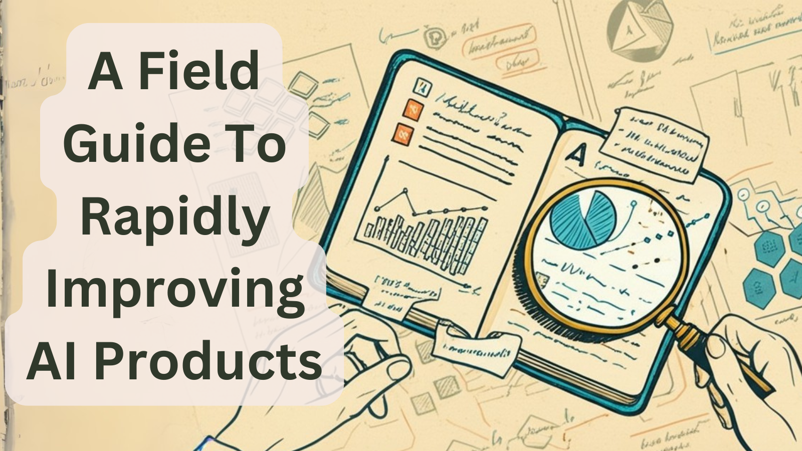

## Q: What are LLM Evals?

If you are completely new to product-specific LLM evals (not foundation model benchmarks), see the posts below. Otherwise, keep reading.

::: {.grid}

::: {.g-col-4}
{target="_blank"}

[**Your AI Product Needs Eval (Evaluation Systems)**](https://hamel.dev/evals){target="_blank"}

**Contents:**

1. Motivation
2. Iterating Quickly == Success  
3. Case Study: Lucy, A Real Estate AI Assistant
4. The Types Of Evaluation
   a. Level 1: Unit Tests
   b. Level 2: Human & Model Eval
   c. Level 3: A/B Testing
   d. Evaluating RAG
5. Eval Systems Unlock Superpowers For Free
   a. Fine-Tuning
   b. Data Synthesis & Curation
   c. Debugging
:::

::: {.g-col-4}
{target="_blank"}

[**Creating a LLM-as-a-Judge That Drives Business Results**](https://hamel.dev/llm-judge/){target="_blank"}

**Contents:**

1. The Problem: AI Teams Are Drowning in Data
2. Step 1: Find The Principal Domain Expert
3. Step 2: Create a Dataset
4. Step 3: Direct The Domain Expert to Make Pass/Fail Judgments with Critiques
5. Step 4: Fix Errors
6. Step 5: Build Your LLM as A Judge, Iteratively
7. Step 6: Perform Error Analysis
8. Step 7: Create More Specialized LLM Judges (if needed)
9. Recap of Critique Shadowing
10. Resources
:::

::: {.g-col-4}
{target="_blank"}

[**A Field Guide to Rapidly Improving AI Products**](https://hamel.dev/field-guide){target="_blank"}

**Contents:**

1. How error analysis consistently reveals the highest-ROI improvements
2. Why a simple data viewer is your most important AI investment
3. How to empower domain experts (not just engineers) to improve your AI
4. Why synthetic data is more effective than you think
5. How to maintain trust in your evaluation system
6. Why your AI roadmap should count experiments, not features
:::

:::

[↗](/blog/posts/evals-faq/what-are-llm-evals.html){.faq-individual-link}