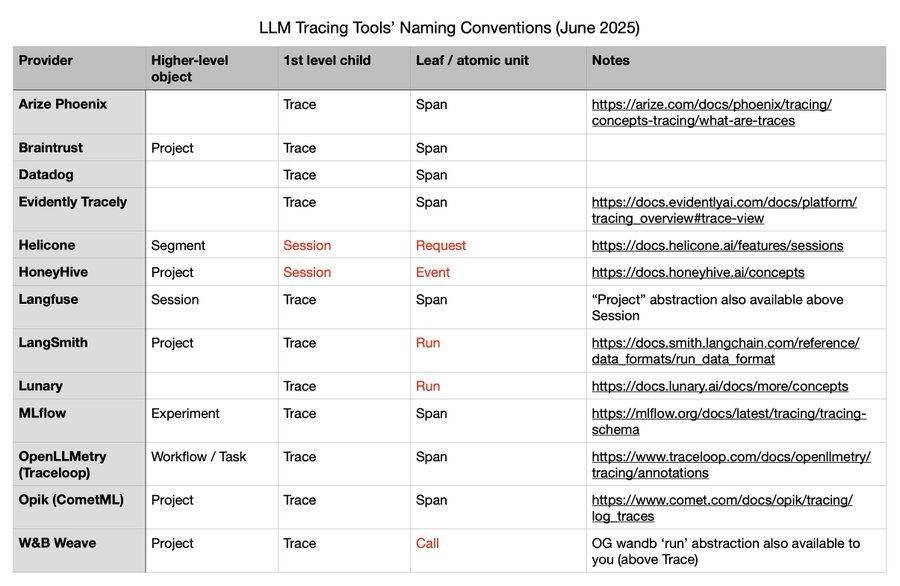

## Q: What is a trace?

A trace is the complete record of all actions, messages, tool calls, and data retrievals from a single initial user query through to the final response. It includes every step across all agents, tools, and system components in a session: multiple user messages, assistant responses, retrieved documents, and intermediate tool interactions.

**Note on terminology:** Different observability vendors use varying definitions of traces and spans. [Alex Strick van Linschoten's analysis](https://mlops.systems/posts/2025-06-04-instrumenting-an-agentic-app-with-arize-phoenix-and-litellm.html#llm-tracing-tools-naming-conventions-june-2025) highlights these differences (screenshot below):

[↗](/blog/posts/evals-faq/what-is-a-trace.html){.faq-individual-link}