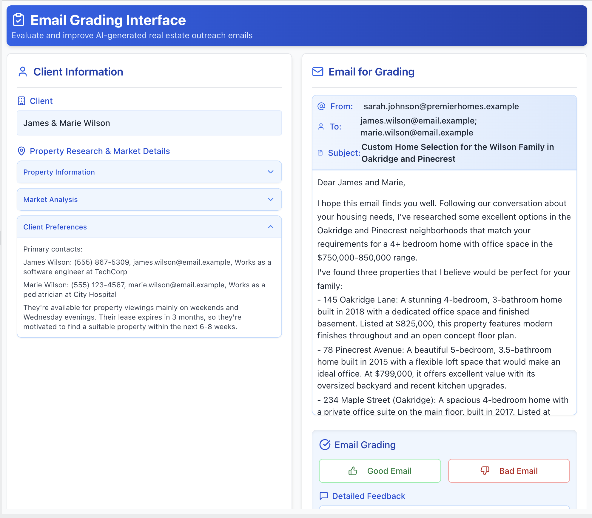
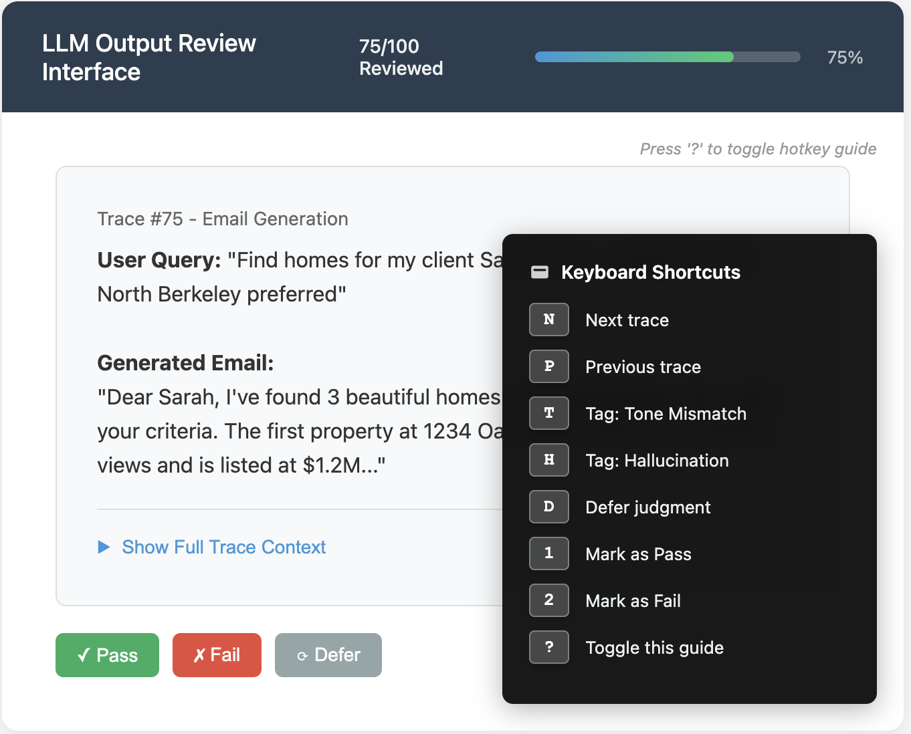
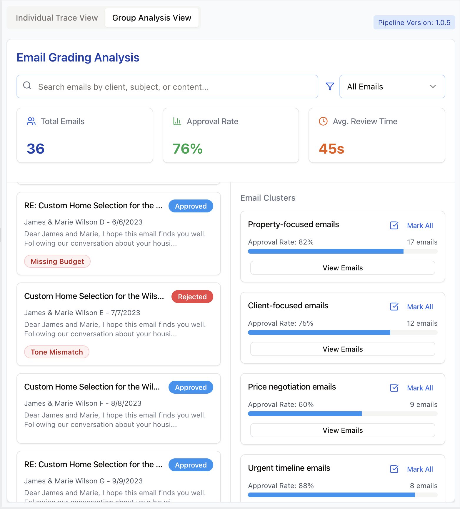
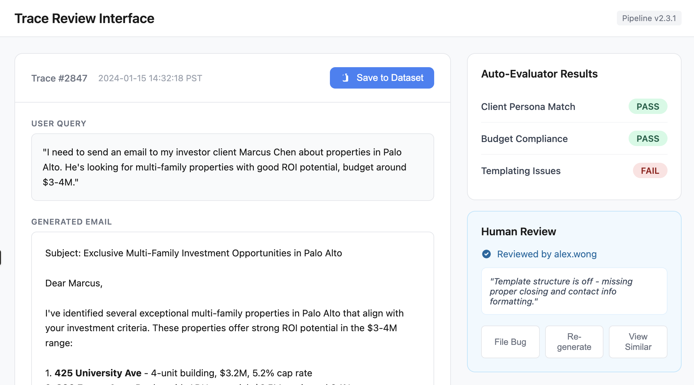

## Q: What makes a good custom interface for reviewing LLM outputs? [↗](/blog/posts/evals-faq/what-makes-a-good-custom-interface-for-reviewing-llm-outputs.html){.faq-individual-link}

Great interfaces make human review fast, clear, and motivating. We recommend [building your own annotation tool](/blog/posts/evals-faq/should-i-build-a-custom-annotation-tool-or-use-something-off-the-shelf.html) customized to your domain. The following features are possible enhancements we've seen work well, but you don't need all of them. The screenshots shown are illustrative examples to clarify concepts. In practice, I rarely implement all these features in a single app. It's ultimately a judgment call based on your specific needs and constraints.

**1. Render Traces Intelligently, Not Generically**: Present the trace in a way that's intuitive for the domain.  If you're evaluating generated emails, render them to look like emails. If the output is code, use syntax highlighting. Allow the reviewer to see the full trace (user input, tool calls, and LLM reasoning), but keep less important details in collapsed sections that can be expanded. Here is an example of a custom annotation tool for reviewing real estate assistant emails:

{width=75%}

**2. Show Progress and Support Keyboard Navigation**: Keep reviewers in a state of flow by minimizing friction and motivating completion. Include progress indicators (e.g., "Trace 45 of 100") to keep the review session bounded and encourage completion. Enable hotkeys for navigating between traces (e.g., N for next), applying labels, and saving notes quickly.  Below is an illustration of these features:

{width=75%}

**4. Trace navigation through clustering, filtering, and search**: Allow reviewers to filter traces by metadata or search by keywords. Semantic search helps find conceptually similar problems. Clustering similar traces (like grouping by user persona) lets reviewers spot recurring issues and explore hypotheses.  Below is an illustration of these features:

{width=75%}

**5. Prioritize labeling traces you think might be problematic**: Surface traces flagged by guardrails, CI failures, or automated evaluators for review. Provide buttons to take actions like adding to datasets, filing bugs, or re-running pipeline tests. Display relevant context (pipeline version, eval scores, reviewer info) directly in the interface to minimize context switching. Below is an illustration of these ideas:

{width=88%}

### General Principle: Keep it minimal

Keep your annotation interface minimal. Only incorporate these ideas if they provide a benefit that outweighs the additional complexity and maintenance overhead.