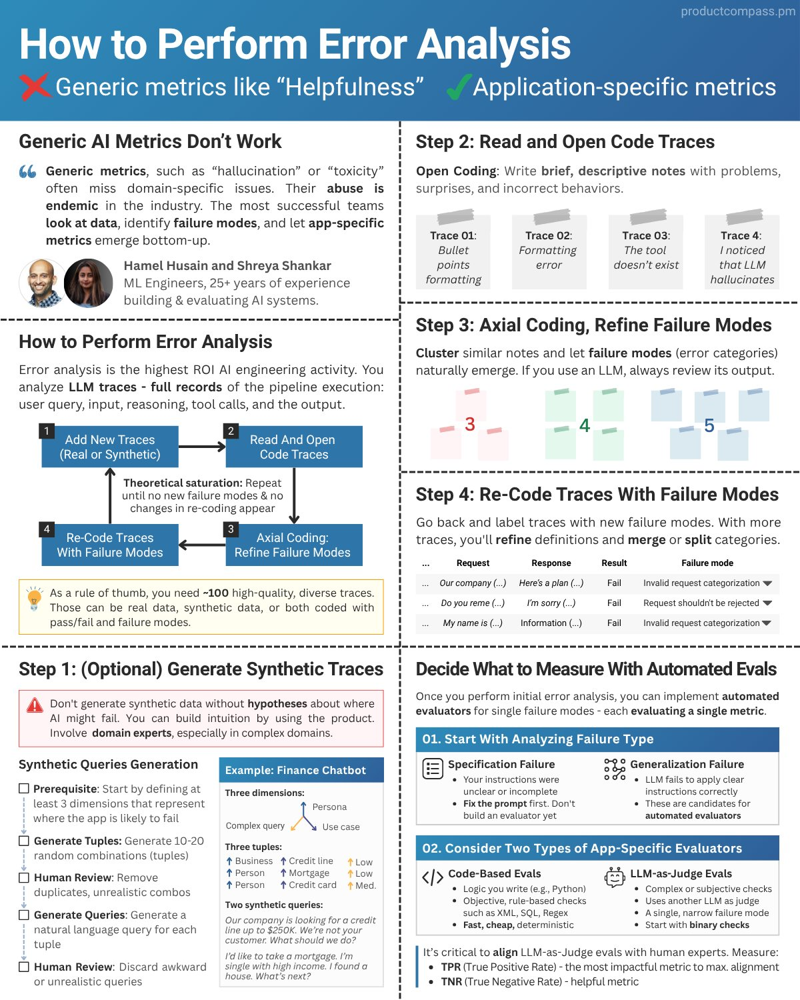

## Q: Why is \"error analysis\" so important in LLM evals, and how is it performed?

Error analysis is **the most important activity in evals**.  Error analysis helps you decide what evals to write in the first place.  It allows you to identify failure modes unique to your application and data. The process involves:

### 1. Creating a Dataset

Gathering representative traces of user interactions with the LLM.  If you do not have any data, you can [generate synthetic data](#q-what-is-the-best-approach-for-generating-synthetic-data){target="_blank"} to get started.

### 2. Open Coding

Human annotator(s) (ideally a [benevolent dictator](#q-how-many-people-should-annotate-my-llm-outputs){target="_blank"}) review and write open-ended notes about traces, noting any issues. This process is akin to "journaling" and is adapted from qualitative research methodologies.  When beginning, it is recommended to focus on noting the [first failure](#q-how-do-i-debug-multi-turn-conversation-traces){target="_blank"} observed in a trace, as upstream errors can cause downstream issues, though you can also tag all independent failures if feasible. A [domain expert](https://hamel.dev/blog/posts/llm-judge/#step-1-find-the-principal-domain-expert){target="_blank"} should be performing this step.

### 3. Axial Coding

Categorize the open-ended notes into a "failure taxonomy.". In other words, group similar failures into distinct categories.  This is the most important step.  At the end, count the number of failures in each category. You can use a LLM to help with this step.

### 4. Iterative Refinement

Keep iterating on more traces until you reach [theoretical saturation](https://delvetool.com/blog/theoreticalsaturation){target="_blank"}, meaning new traces do not seem to reveal new failure modes or information to you.  As a rule of thumb, you should aim to review at least 100 traces.

You should frequently revisit this process.  There are advanced ways to [sample data more efficiently](how-can-i-efficiently-sample-production-traces-for-review.html){target="_blank"}, like clustering, sorting by user feedback, and sorting by high probability failure patterns.  Over time, you'll develop a "nose" for where to look for failures in your data. 

Do not skip error analysis.  It ensures that the evaluation metrics you develop are supported by real application behaviors instead of counter-productive generic metrics (which most platforms nudge you to use). For examples of how error analysis can be helpful, see [this video](https://www.youtube.com/watch?v=e2i6JbU2R-s){target="_blank"}, or this [blog post](https://hamel.dev/blog/posts/field-guide/){target="_blank"}.

Here is a visualization of the error analysis process by one of our students, [Pawel Huryn](https://www.linkedin.com/in/pawel-huryn/){target="_blank"} - including how it fits into the overall evaluation process:

[↗](/blog/posts/evals-faq/why-is-error-analysis-so-important-in-llm-evals-and-how-is-it-performed.html){.faq-individual-link}