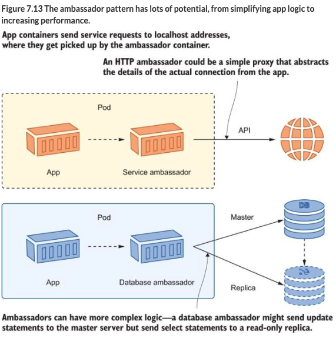

[[Ambassador]]

These are [[Sidecar]] containers that act as proxys.  You can do this for reliability or security.  Proxy containers can do load balancing, retries, or encrypt items.  [[service mesh]] uses patterns like this. 

For example you may want to restrict what web requests or URLs your app is allowed to talk to.  With an ambassador sidecar, you can block all traffic besides the allowed one.   Here is an example:

```yaml
      containers:
        - name: web
          image: kiamol/ch03-numbers-web 
          env:
          - name: http_proxy
            value: http://localhost:1080
          - name: RngApi__Url
            value: http://localhost/api
        - name: proxy                         # this is a basic proxy
          image: kiamol/ch07-simple-proxy          
          env:
		  - name: Proxy__Port                 #Routes network requets given 
            value: "1080"                     # the below mapping
          - name: Proxy__Request__UriMap__Source
            value: http://localhost/api
          - name: Proxy__Request__UriMap__Target
            value: http://numbers-api/sixeyed/kiamol/master/ch03/numbers/rng

```

In the above example, anything that is not in the mapping  is blocked.   Now the web app is restricted to a single address for outgoing requests, which are logged by the proxy. 

the app container uses localhost addresses for any services it consumes, and it’s configured to route all network calls through the proxy container. The proxy is a custom app that logs network calls, maps localhost addresses to real addresses, and blocks any addresses that are not listed in the map. All that becomes functionality in the Pod, but it’s transparent to the application container.

You can also use Ambassador's for database connections, to query read-only copies when there are no db updates/writes:



