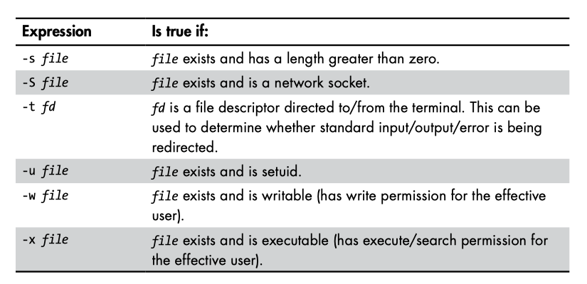
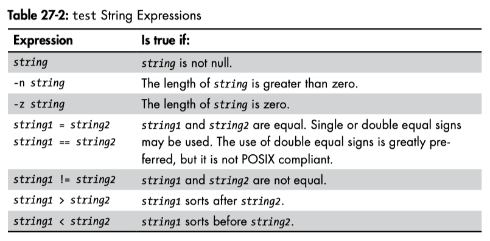
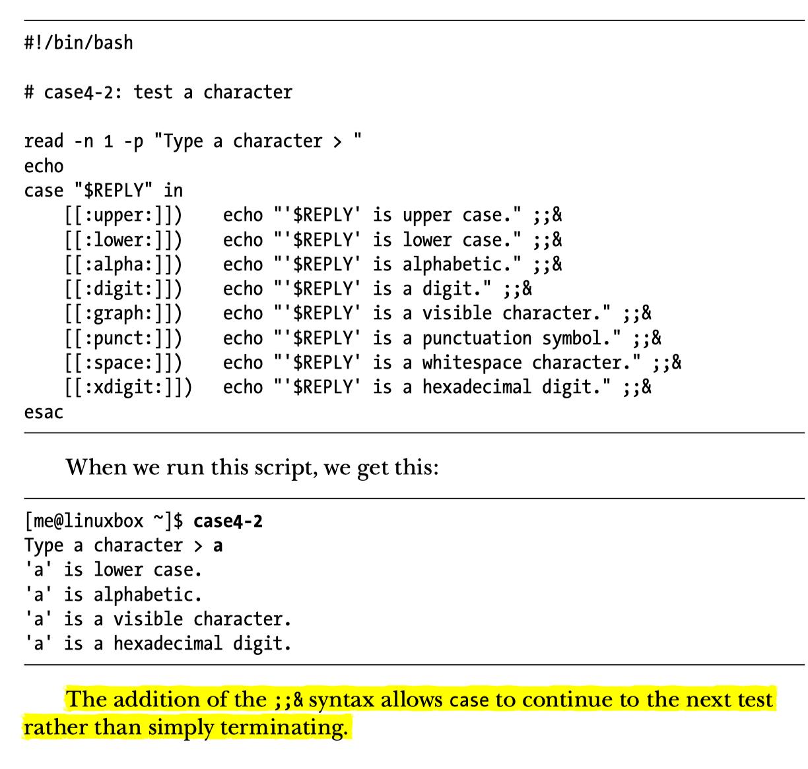
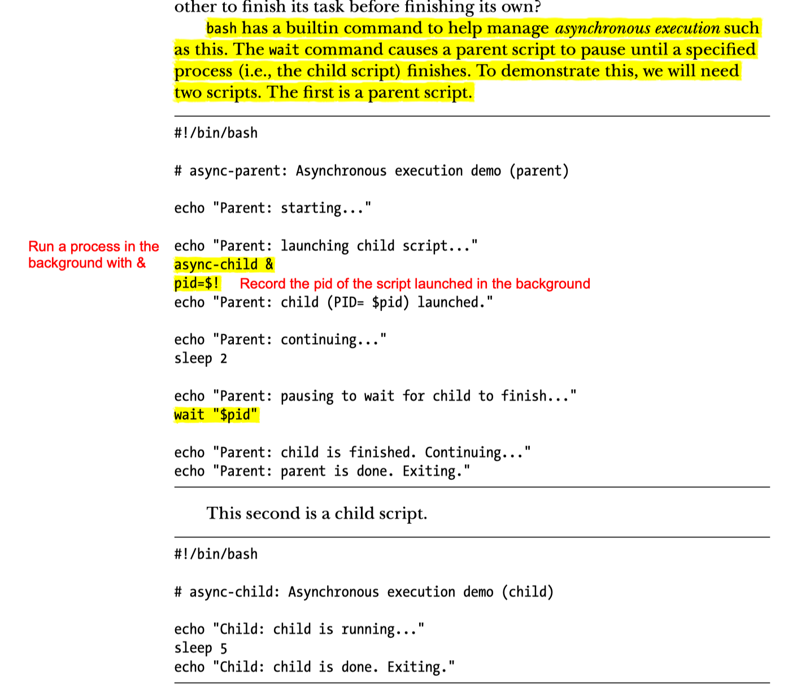
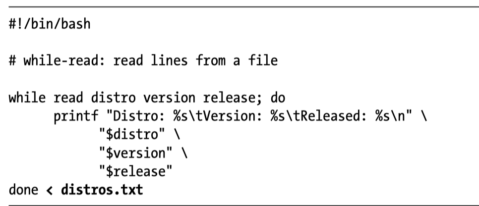

# Bash Scripting Class Linux Academy
- [Link](https://linuxacademy.com/linux/training/course/name/the-system-administrators-guidep-to-bash-scripting) to class.
- [Link](https://github.com/hamelsmu/bash_scripting) to GitHub repo


<TOCInline toc={toc} />;

## History of Bash

- was originally a program called `bin/sh`
- Bourne Shell: introduced more advanced structure into the shell.  
- **Bourne Again Shell (Bash):**  Second iteration of Bourne Shell.

## Bash Configuration

```shell
ls -a ~/ | grep bash
      .bash_history
      .bash_profile
      .bash_profile.backup
      .bash_profile.bensherman
      .bash_profile_copy
      .bash_sessions/
      git-completion.bash
```

### .bash_profile

- `.bash_profile`: executed when you `login` -> configures the shell when you get an initial command prompt.  This is different than `.bashrc`.  
- commonly loads the `~/.bashrc` file as well. 

- `bin` is traditionally the folder for binaries.

- `bash_profile` is designed to run when you login, so if you change it will not refresh until you login next time.  


### .bashrc

- `.bashrc` it is executed simply before the command shell comes up, does not have to wait until you login.

- `etc/bashrc` are system bashrc files which is like a "template" for user bashrc files.  Anytime a new user is created, it inherits from this template and sometimes automated customizations are applied.  This is usually done by simply importing `etc/bashrc` from each user's `bashrc` file.

- `env` will list all env variables.

- to apply `.bashrc` you just have to run the command `bash` as it will start another shell from your current one.  However, if you run `bash` you can now `exit` without closing the shell, because a shell is running inside another shell.


### .bash_history

- `~/.bash_history` contains lots of history.  By default will only capture last 100 but you can change this setting.  
- you can exlude something from saving to history (like passwords) by using an `ignorespace`
- the environment variable `HIST_CONTROL` can be used to control how much history to keep and settings about what should not be logged.  One way to turn off loggin is:
    ```bash
    export HISTCONTROL=$HISTCONTROL:ignorespace
    ```
    this allow you to skip logging by adding a space to the the beginning of any command.  If you want to see what is in `HIST_CONTROL` you will see:

    ```bash
    > cat ~/.bash_history | grep HISTCONTROL
    HISTCONTROL=ignoredups:ignorespace
    ```

    ignoredups was already set to this variable.

### .bash_logout

- Doesn't always exist on a system.  in most cases the contents of the `~/.bash_logout` will be empty or contain a comment.
- The role of this file is to execute things when you exit the shell.  If you close the shell it will __not work__, you have to do a **clean exit** instead.
- Common use is to use this to clear out ~/.bashrc with the original to clear out any changes the user may have made.  You can accomplish this by copying a backup:

    ```bash
    cp ~/.bashrc.original ~/.bashrc
    ```

## Shell Scripts

Put your shell scripts in a folder you can find them.  We can put them in `~/bin`:
    
    > mkdir bin

Make sure in `~/.bash_profile` you have:

```bash
PATH=$PATH:$HOME/bin
export PATH
```

### chmod u+x

- To make `test.sh` executable run command `chmod u+x test.sh`

You can also run `chmod 755`


### Using Variables on The Command Line

- can use any name that is not an environment variable (check with `env`).
- by convention variable names in ALLCAPS.
    ```bash
    > FIRSTNAME="Hamel"
    ```

		- No space b/w = and value.
		- Good idea to __always__ put value in double quotes `"`, although this is not required in every case.  
    
- As a practice you want to use `export` command to set is as an environment variable.  This makes the variable available to any subprocess that starts from the shell.  Read more about this [here](https://stackoverflow.com/questions/1158091/defining-a-variable-with-or-without-export).
    
    ```bash
    > export FIRSTNAME
    > echo "Hello, $FIRSTNAME"
    "Hello Hamel"

    > export FIRSTNAME="Hamel" # do this in one step
    ```
    The above example could work without `export`, too just reinforcing that its a good idea to use this as a habit.  You can do this in one step:
    

#### Using Substitution with backticks

```bash
> export TODAYSDATE=`date`  # executes date command
```


### Using Variables in Scripts

    ```bash
    MYUSERNAME='hamel'
    MYPASSWORD='password'
    STARTOFSCRIPT=`date`

    echo "My login name for this app is $MYUSERNAME"
    echo "My login password for this app is $MYPASSWORD"
    echo "I started this script at $STARTOFSCRIPT"

    ENDOFSCRIPT=`date`

    echo "I ended the script at $ENDOFSCRIPT"
    ```

- These variables only live within the sub-shell that executes the script.

### Command Subsitution

- **Method 1 (Static)**: Assign command result to variable.  Only runs the command at time of variable assignment.

```bash
    TODAYSDATE=`date`
    USERFILES=`find /home -user user` # find all directories owned by the user "user"

    echo "Today's Date: $TODAYSDATE"
    echo "All files owned by USER: $USERFILES"
```

- **Method 2**: Use an alias, which allows you to run a command every time you call the alias. For aliases to work this way you must use the **shopt** command, which allows aliases to be useable in shell scripts.  Technically referred to as "expanding aliases within a subshell".

```bash
    #!/bin/bash
    shopt -s expand_aliases

    # notice that we don't use backticks here because the command we want to execute is put in ".."
    alias TODAY="date" 
    alias UFILES="find /home -user user"


    A=`TODAY` #Executes the command date
    B=`UFILES`#Executes the command 
    echo "With Alias, TODAY is: $A" echo "With Alias, UFILES is: $B"
```

### Exit Status

- Value = 0 means everything is ok
- Value != 0 means something is wrong.

- See last exit status w/ the `$?` command:

```bash
    > ls
    > echo $?
    0
```

#### Using exit statues in a shell script

- Unlike python, shell scripts will continue executing even if there is an error.  You can prevent this by using `set -e`

```bash
    set -e # means exit the shell if there is an error, don't continue.
```

### Arithmetic Operations

```bash
    expr 1 + 2
    expr 2 \* 2 # you have to escape the *
    expr \( 2 + 2 \) \* 4  # you must also escape the ( )
```
    
- Caveat: **You need a space** on each side of the operator.

## Global and Local Environment Variables

- `env` and `printenv` will tell you your global vars
- `set` will give you things from your session. This will also usually contain everything from your global scope.  `set` is a superset of `env`.

- Reserved names: see study guide or google it.

### `unset` : Delete An Environment Variable
`unset MY_VAR`

## Special Characters: Quotes & Escapes

- `$` escapes a single character.
- single quotes `'`..`'` treats something as a string, escapes the whole thing
- double quotes do __not escape anything__.

```bash
> echo "\$COL"  # this will escape the $
$COL

> echo '$COL' # single quotes escape things, means the literal string
$COL

> echo "$COL" # does not escape anything
250

> echo "The date is: `date`" # command substitution with bacticks
The date is Mon Jul 25
```

# Redirecting Output

## Using dev/null

Use `dev/null` when you want to discard output and don't want to put in the background. `/dev/null` is a device, and like everything is a file in linux.  Everything you write to `dev/null` just dissapears.

For example:

```bash
#!/bin/bash
#redirect to dev/null example

echo "This is going to the blackhole." >> /dev/null
```

Note `>>` (append) or `>` (overwrite) will work for dev/null, although out of habit in other scenarios it is better to append when unsure using `>>`.

## Redirect  Std Error

`ls -l /bin/usr 2> ls-error.txt`

## Redirect Std Out & Err into one file

`ls  -l /bin/sur > ls-output.txt 2>&1`


Shortcut: use `&`

`ls  -l /bin/sur &> ls-output.txt`

## Dispose Std Err output `/dev/null`

`ls -l /bin/sur 2> /dev/null`


# The Read Statement

note the backticks and the `expr` command

```bash
echo "Enter Your First Name: "
read FIRSTNAME

echo "Enter Your Last Name"
read LASTNAME

echo "Your Full Name is $FIRSTNAME $LASTNAME"

echo "Enter Your Age: "
read USERAGE

echo "In 10 Years, You will be `expr $USERAGE + 10` years old."
```

# Shell Expansion

```bash
> echo sh{ot,oot,ort}
shot shoot short

> echo st{il,al}l
still stall

> echo "$[ 2 * 2 ]"
4

# set and display var at same time
> echo "${VARNAME:=something}"
something
> echo $VARNAME
something

# will print any environment variable that starts with HO
> echo "${!HO*}"
OME HOSTNAME HOSTTYPE
```

## Brace Expansion
```sh
> echo Hello-{Foo,Bar,Baz}-World                             
Hello-Foo-World Hello-Bar-World Hello-Baz-World
```


## Parameter Expansion, Like Coalesce

`{parameter:-word}`


If parameter is unset (i.e., does not exist) or is empty, this expansion results in the value of word. If parameter is not empty, the expansion results in the value of parameter.


# Types of Variables

Variables are declared implicitly, and the value will implicitly determine what kind of variable it is.  However, it could be useful to explicitly define the type.

```bash
# an integer variable
MYVAR=4

# use command substitution
> echo `expr $MYVAR + 5`
9
```

Show the type of the variable, using `decalre -p`

```bash
MYVAR=4

# this shows you MYVAR is a string
> declare -p MYVAR
declare -- MYVAR="4"
```
Interpreting the output of `declare -p`: `--` tells you that this variable is not strongly typed and its type has not been declared.

Set the type of the variable, using `decalre -i`
**notice how the value is converted to zero** when setting `NEWVAR` to a string when you have declared it as an integer. 

```bash
> declare -i NEWVAR=10
> declare -p NEWVAR
declare -i NEWVAR="10"

> NEWVAR="Hello"
> echo $NEWVAR
0
```

Notice in the output instead of `--` we have `-i` which means this variable is an integer.

#### Readonly Variables
```
> declare -r READONLY="This is a string we cannot overwrite"
> declare -p READONLY
declare -r READONLY="This is a string we cannot overwrite"
```
The `-r` in the output confirms this is a readonly variable. 

Equivalent to `declare -r`, using the `readonly` command:

```bash
readonly MYREADONLY="This String"
```

## Types of Variables 


```bash
# declare int variable:
> declare -i NEWVAR=10

# inpsect type of NEWVAR
> declare -p NEWVAR
declare -i NEWVAR="10"

# declare readonly variable
> declare -r READONLY="This is something we cannot overwrite"

# try to cancel READONLY type
> declare +r READONLY
### will result in an error
```

Variables in bash are implicitly typed, the type will be inferred from the value you assign.

- determine the type of a variable: `declare -p $MYVAR`
- declare variable as integer: 
    ```bash 
    declare -i NEWVAR=10
    ```
- If you explicitly declare a variable as an int but assign it to a string, it will implicitly convert the value to `0`.


# Arrays

Indexing **starts at zero.**  Notice that arrays are **space-delimited.**, this is a strange thing if you are used to arrays w/commas.

You can have spaces in values if you enclose the spaces in double-quotes.

```bash
# notice no commas just spaces!
> MYARRAY=(“First” “Second” “Third”)
> echo ${MYARRAY[2]}
“Third”
```

### Iterating Through Arrays

```bash
#!/bin/bash
# simple array list and loop for display

SERVERLIST=(“websrv01” “websrv02” “websrv03”)
COUNT=0

for INDEX in ${SERVERLIST[@]}; do
    echo “Processing Server: ${SERVERLIST[COUNT]}”
    COUNT=“`expr $COUNT + 1 `”
done
```

You cannot decrease the size of the array, you can only increase the size of the array.

### Passing Variables to Scripts at the Command Line

```bash
echo “The following item was passed to the script at run time $1”
```

The arguments go from 1-n (starts at 1).

if you have an argument that contains a space, then you wan to enclose this in quotes, otherwhise space is seen as a delimiter.


# Conditionals

## The if statement

```bash
3
echo “Guess the Secret Number”
echo “======================“
echo “”
echo “Enter a Number Between 1 and 5”
read GUESS


if [ $GUESS -eq 3 ]
    then
        echo “You guessed the Correct Number!”
fi
```

Test if a file exists

```bash
FILENAME=$1
echo “Testing for the existence of a file called $FILENAME”

if [ -a $FILENAME ]
    then
        echo “$FILENAME does exist!”
fi

# negation operator 
if [! -a $FILENAME ]
    then
        echo “$FILENAME does not exist!”
fi

# test multiple expressions in if statement

if [ -f $FILENAME ] && [ -R $FILENAME]
    then
        echo “File $FILENAME exists and is readable.”
fi
```

`-a` is the same as `-f` w.r.t. testing for the existence of a file.

## If/Then/Else

```bash
echo “Enter a number between 1 and 3:”
read VALUE

# use semicolons for readability
if [ “$VALUE” -eq “1” ]; then
    echo “You entered $VALUE”
fi
```

Using an OR statement:

```bash
# another variation
if [ “$VALUE” -eq “1” ] || [ “$VALUE” -eq “2” ] || [ “$VALUE” -eq “3” ]; then
    echo “You entered $VALUE”
else
    echo “You didn’t follow directions!”
fi
```

**Redirect errors to /dev/null**

```bash
if [ “$VALUE” -eq “1” ] 2>/dev/null || [ “$VALUE” -eq “2” ] 2>/dev/null || [ “$VALUE” -eq “3” ] 2>/dev/null; then
    echo “You entered $VALUE”
else
    echo “You didn’t follow directions!”
fi

if [ “$VALUE” -eq “1” ] 2>/dev/null; then
    echo “You entered #1”
elif “ "$VAL”E" -e“ ”2" ] 2>/dev/null; then
    ech“ "You entered ”2"
elif “ "$VAL”E" -e“ ”3" ] 2>/dev/null; then
    ech“ "You entered ”3"
else
    ech“ "You di’n't follow direction”!"
fi
```

# Conditional Expressions

Hamel's Note: Use Double Brackets `[[ ]]`, not single brackets

## File Expressions





## String Expressions




## Integer Expressions


# Aside: Output Streams

https://askubuntu.com/questions/625224/how-to-redirect-stderr-to-a-file

**1**: stdout

**2**: stderr

error messages are printed to standard error. The classic redirection operator (command > file) only redirects standard output, so standard error is still shown on the terminal. To redirect stderr as well, you have a few choices:

```bash
# Redirect stdout to one file and stderr to another file:
command > out 2>error

# Redirect stderr to stdout (&1), and then redirect stdout to a file:

command >out 2>&1

# Redirect both to a file (this isn’t supported by all shells, bash and zsh support it, for example, but sh and ksh do not)
command &> out
```

# Control Flow

- `break` exits the loop
- `continue` goes to next iteration in loop
- `until` is opposite of while

## For Loop

```bash
#!/bin/bash
echo “List all the shell scripts contents of the directory”
SHELLSCRIPTS=`ls *.sh`

# alternate using for loop

for FILE in *.sh; do
    echo “$FILE”
done
```

## Case Statement

```bash
#!/bin/bash

echo “1) Choice 2”
echo “2) Choice 2”
echo “3) Choice 3”
echo “Enter Choice:”

read MENUCHOICE

case $MENUCHOICE in
    1)
        echo “You have choosen the first option”;;
    2)
        echo “You have chosen the second option”;;
    3) 
        echo “You have selected the third option”;;
    *)
        echo “You have choosen unwisely”;;
```

### Match Multiple Case Statements

Allow many matches to occur




## While Loop

```bash
#!/bin/bash

echo “Enter number of times to display message:”
read NUM

COUNT=1

# -le means less than or equal to
while [ $COUNT -le $NUM ]
do
    echo “Hello World $COUNT”
    COUNT=“`expr $COUNT + 1`”
done
```

## Asynchronous Execution with `wait`




This is the most straightforward implementation of async I have ever seen.  You basically decide when to block and wait for a process that you previously decided to run in a child process.  


## Short Circuit Expressions

### &&: `command1 && command2`: 

 only run `command2` if `command1` is successful

### ||: `command1 || command2`: 

only run `command2` if `command1` fails


# Execution Operators

the file super duper does not exist

    rm superduper 2> /dev/null && echo "File was deleted"

The `echo` will only execute if the `rm` command was successful and exits without errors.  Therefore, in this case the `echo` statement will not be triggered.

    rm superduper 2> /dev/null && echo "File was deleted" || echo "File does not exit"

Because of short-circuiting rules, the second statement of the OR || will not trigger unless the left hand side is false. 


1. `&&` :  and
2. `||` :  or


# Input/Output

## Reading Files

```bash
echo “Enter a filename” 
read FILE

while read -r SUPERHERO; do
    echo “Superhero Name: $SUPERHERO”
done < “$FILE”
```

## Reading Files with loops



## File Descriptors

Use a number >= 3 for file descriptors.

0 - stdin
1 - stdout
2 - stderr

/dev/null -> generic place where you can redirect streams into nothing.

```bash
#!/bin/bash

echo “Enter file name: “
read FILE

# < means readonly,  > means write only,  <> means allow read & write
# assign file descriptor to filename
exec 5<>$FILE

while read -r SUPERHERO; do
    echo “Superhero Name: $SUPERHERO”
done <&5 #use & to reference the file descriptor

# append to end of file.
echo "File Was Read On: `date`" >&5

# close file descriptor
exec 5>&-
```

## Delimiters (IFS)

IFS - Internal Field Seperator
Default is a space

```bash
# this will return a space
echo $IFS
```

```bash
echo "Enter filename to parse: "
read FILE # spacedelim.txt

# https://stackoverflow.com/questions/24337385/bash-preserve-string-with-spaces-input-on-command-line

while read -r CPU MEM DISK; do
    echo "CPU: $CPU"
    echo "Memory: $MEM"
    echo "Disk: $DISK"
done <"$FILE"
```

## Traps and Signals


https://www.gnu.org/software/libc/manual/html_node/Termination-Signals.html
- `cntrl+c` = SIGINT
- `cntrl+z` = SIGTSTP
- `kill` command (without -9 flag) = SIGTERM
- `kill -9` = SIGKILL;  this signal is not sent to the process, it is just killed.

```bash
clear

# first argument is what to exexute 
trap 'echo " - Please Press Q to Exit."' SIGINT SIGTERM SIGTSTP

# cntrl+c = SIGINT
# cntrl+z = SIGTSTP  (Suspend, send to background)


while [ "$CHOICE" != "Q" ] && [ "$CHOICE" != "q" ]; do
    echo "Main Menu"
    echo "======="
    echo "1) Choice One"
    echo "2) Choice Two"
    echo "3) Choice Three"
    echo "Q) Quit"
    read CHOICE

    clear
done
```

# Debugging Shell Scripts

`bash -x` will run a shell script in debug mode.

google this to figure out how to interpret output of debugging.

# Error Handling

`$?` contains the status code of the last command.

What if you have the code:

```bash
#!/bin/bash
echo "Change to a directory and list the contents"
DIRECTORY="$1"
cd $DIRECTORY

# DANGER: the below command will still run even if the previous command failed!
rm *
```

Solution:

```bash
DIRECTORY="$1"
cd $DIRECTORY

if [ $? -eq "0" ]; then
    echo "Changed directory successfully into $DIRECTORY"
else
    echo "Cannot change driectories, exiting with error."
    exit 111 # you can exit with any code you want!
fi
```

# Functions

```bash

funcExample () {
    echo "We are inside the function"
}

#call the function
funcExample

```
## structure of functions in a shell script

Unlike python, **you must define your functions before you call them.**

## Scope

setting a variable within a function **defines that variable globally** after that function is called!!!

```bash
GLOBALVAR=“Globally Visible”

# sample function for function variable scope
funcExample () {
    # local
    LOCALVAR=“Locally Visible”

    echo “From within the function, the variable’s value is set to $LOCALVAR …”
}

# script start

echo “this happens before the function call”
echo “”
echo “Local Variable = $LOCALVAR after the function call.”
echo “Global Variable = $GLOBALVAR (before the function call).”

funcExample

echo “this happens after the function call”
echo “Local Variable = $LOCALVAR after the function call.”
echo “Global Variable = $GLOBALVAR (before the function call).”
```

Output of above code:

```
 ./scope.sh
this happens before the function call

Local Variable =  after the function call.
Global Variable = Globally Visible (before the function call).
From within the function, the variable’s value is set to Locally Visible …
this happens after the function call
Local Variable = Locally Visible after the function call.
Global Variable = Globally Visible (before the function call).
```

## Functions With Parameters

```bash
# global
USERNAME=$1

funcAgeInDays () {
    echo “Hello $USERNAME, You are $1 Years old.”
    echo “That makes you approx `expr 365 \* $1` days old”
}

#script - start
read -r -p “Enter your age:” AGE

# pass in arguments like this
funcAgeInDays $AGE
```

## Nested Functions

Author of course uses this for organization purposes.  When you call a function if it has nested functions the functions defined within will be exposed to the script also.

```bash
# global
GENDER=$1

funcHuman () {
    ARMS=2
    LEGS=2

    funcMale () {
        BEARD=1
        echo “This man has $ARMS arms and $LEGS legs with $BEARD beard”
    }

    funcFemale () {
        BEARD=0
        echo “This woman has $ARMS arms and $LEGS legs with $BEARD beard”
    }
}

# script start
clear

# determine the actual gender and display the characteristics.
if  [ “$GENDER” == “male” ]; then
    funcHuman
    funcMale # this function is available after the parent function is called.
else
    funcHuman
    funcFemale
fi
```

## Function Return and Exit

This allows you to get arguments from the command line and then exit with a proper code and also use function returns inside scripts.

```bash
# demo of return values and testing results

YES=0
NO=1
FIRST=$1
SECOND=$2
THIRD=$3

# function definitions

funcCheckParams () {
    # did we get three
    # -z equivalent to isnull (in this case means not-null b/c of !)
    if [ ! -z “$THIRD” ]; then
        echo “We got three params”
        return $YES
    else
        echo “We did not get three params”
        return $NO
    fi
}

# script start

funcCheckParams
# the return value from the function gets stored in $?
RETURN_VALS=$?

if [ “$RETURN_VALS” -eq “$YES” ]; then
    echo “We received three params and they are:”
    echo “Param 1: $FIRST”
    echo “Param 2: $SECOND”
    echo “Param 3: $THIRD”
else
    echo “Usage: funcreturn.sh [param1] [param2] [param3]”
    exit 1
fi
```

# Interactive Menus

## Infobox

Dissappears unless you sleep (see below).  Does not come with any buttons. 

```bash
# globals
INFOBOX=${INFOBOX=dialog}
TITLE=“Default”
MESSAGE=“Something to say”
XCOORD=10
YCOORD=20

funcDisplayInfoBox () {
    $INFOBOX —title “$1” —infobox “$2” “$3” “$4”
    sleep “$5”
}
```

## Msgbox

Msgbox - dissapears unless you sleep pass `--msgbox` argument, comes with default ok button and stays on screen.


```bash
# global
MSGBOX=${MSGBOX=dialog}
TITLE=“Default”
MESSAGE=“Some Message”
XCOORD=10
YCOORD=20

funcDisplayMsgBox () {
    $MSGBOX —title “$1” —msgbox “$2” “$3” “$4”
}
```

## Menus

See pdf notes/scripts