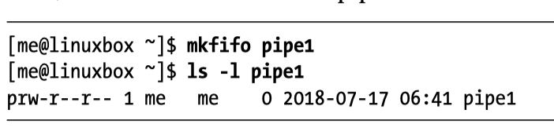
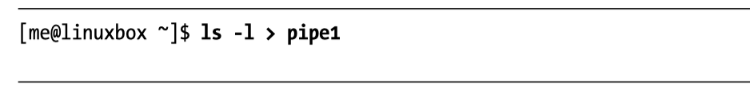
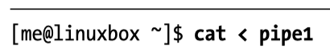
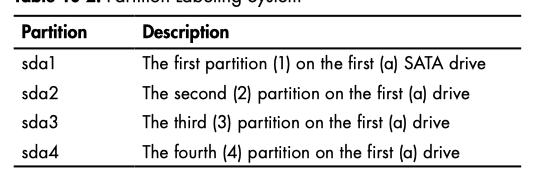
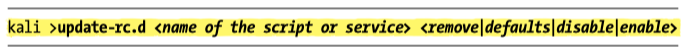

<TOCInline toc={toc} />;


## History
- See history with `history` command
- You will get a number for each `history` item.  
- You can replay any number `n` with command `!n`
- History on OS X is stored in `~/.zsh_history`

 `!n` refer to command number n in `history` when you call history


## Diff
You can difff two files, you usually want to see a unified diff b/c that is easier to read

`diff -u file1.txt file2.txt`


## Here Documents

Instead of using echo, our script now uses cat and a here document. The string _EOF_ (meaning end of file, a common convention) was selected as the token and marks the end of the embedded text. Note that the token must appear alone and that there must not be trailing spaces on the line.


Unlike Echo, all double quotes and single quotes are escaped.  Here is an example of the same thing at the command line.

```bash
[me@linuxbox ~]$ foo="some text"
[me@linuxbox ~]$ cat << _EOF_
> $foo
> "$foo"
> '$foo'
> \$foo
> _EOF_ 
some text 
"some text" 
'some text' 
$foo
```


# Named Pipes with `mkfifo`
Named pipes are input/output buffers.  You can fill up the buffer and then drain the buffer later.  

1. Setup Named Pipe using `mkfifo`


2. Fill up the named pipe, this will hang until the pipe is drained

Hamel: you can run this part in a sub shell




3. In a NEW terminal window drain the pipe




Hamel: put it all together in a script.  You can drain the pipe as many times as you want.

```bash
#!/bin/bash

mkfifo pipe1
ls -l > pipe1 &
cat < pipe1
```

# Scan host for open ports w/ `nmap`

1. Lookup ip with `nslookup`
2. `nmap -sT <IP address>`

You can scan a range of IPs for a mysql port like so:

`nmap -sT 192.168.181.0/24 -p 3306 -oG MySQLScan`

This is useful if you have a public server and you want to verify that a port is open.


# Devices `/dev`
Linux has a special directory that contains files representing attached devices.  Important ones are `sda1`, `sda2` , `sda3`, `sdb` and `sdb1`




You can view a tree of your disks and the partitions with the utility `lsblk`


## Mounting devices

Sometimes you need to mount these devices.  Two common mount points are `/mnt` and `/media`.  If you mount the device into an existing directory it will cover the contents of that directory making them invisible and unavailable.  

Ex: mount device to `/mnt`

`mount /dev/sb1 /mnt`


Ex: mount flash drive

`mount /dev/sdc1 /media`

You can unmount a device with `unmount`:

`unmount /dev/sb1`

## Getting information on mounted drives
`df -h`

## Permanently deleting files with `shred`
This utility writes over files many times in order to erase things.  Helpful for sensitive data.

# Masking your IP for web scraping
Look into `proxy chains`

Linux utility called `proxychains` which generally works as:

`proxychains <the command you want proxied> <arguments>`

`proxychains` defaults to using Tor if you don't  supply your own proxies.

See: https://www.technocrazed.com/how-to-use-beagle-scraper-safely-to-scrape-e-commerce-platforms

# Running Scripts At System Startup
Look at `rc` scripts.  After the kernel has initialized all its modules, it starts adaemon known as `init` or `initd`, which runs scripts found in `/etc/init.d/rc`

You can use the utility `update-rc.d` to add a script to the startup procedure:



This is useful if for example you always want to start a database on system startup.