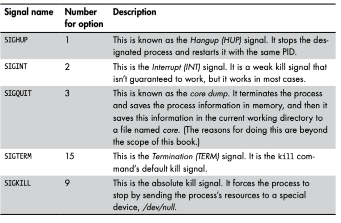

<TOCInline toc={toc} />;

## References

Files associated with this tutorial can be found [here](https://github.com/hamelsmu/notes/tree/master/docs/linux/_reference_files).

## Managing Processes (ps, kill, pkill)

### Kill Single Process (ps, kill)

A common scenario is that you might run a python script to train a model:

$ python train.py 

Let’s say you want to kill this script for whatever reason. You might not always be able to type Cntrl + C to stop it, especially if this process is running in the background. (Aside: A way make a program run in the background is with a & for example:$ python train.py & )

In order to find this running program, you can use the command ps 

**$ ps** Gives you basic information (good enough most of the time)

Flags:

* **-e** Allows you to see all running processes including from other users

* **-f** Allows you to see additional information about each process

In order to kill the process you will want to identify it’s PID for example, if the PID is 501 you can kill this process with the command:

**$ kill 501**

### Killing Multiple Processes (pkill)

If you use process-based threading in python with a library like multi-processing, python will instantiate many processes for you. This is common thing to do in python for a task like data processing.

Let’s consider the below example. When you run this in the background it will produce 8 processes:

```py
from multiprocessing import Pool
from time import sleep

def f(x):
    sleep(1000) # simulate some computation
    return x*x

if __name__ == '__main__':
    with Pool(8) as p:
        print(p.map(f, range(8)))
```
> $ python train_multi.py & 

After a few seconds, calling the command ps will yield something like this:

    PID TTY           TIME CMD
     3982 ttys002    0:00.09 ...MacOS/Python train_multi.py
     4219 ttys002    0:00.00 ...MacOS/Python train_multi.py
     4220 ttys002    0:00.00 ...MacOS/Python train_multi.py
     4221 ttys002    0:00.00 ...MacOS/Python train_multi.py
     4222 ttys002    0:00.00 ...MacOS/Python train_multi.py
     4223 ttys002    0:00.00 ...MacOS/Python train_multi.py
     4224 ttys002    0:00.00 ...MacOS/Python train_multi.py
     4225 ttys002    0:00.00 ...MacOS/Python train_multi.py
     4226 ttys002    0:00.00 ...MacOS/Python train_multi.py

You can find all processes with the file train_multi.py with the pkill command and the -f flag:


### See Parent / Child Processes (pstree)

pstree is also a helpful utility to see parent/child relationships between processes. You can install pstree on a mac with brew install pstree

In the above example, there are 8 sub-processes created by one python process. Running the command

**$ pstree -s train_multi.py** 

Will show the process hierarchy. The -s  flag allows you to filter parents and descendants of processes containing a string in their command. In the below example, PID 41592 will kill all the 8 child processes seen below


### Killing Process Options




Reminder: view processes with `ps` or `top`
To show processes from all users `ps aux`

- To restart pid 6996
	 `kill -1 6996`

- kill pid 6996
	`kill -9 6996`


You can kill processes by name (which is also usually listed as the command that started the processes).  `killall` will search for the string int he relevant process.

### Bringing processes back into the foreground
Reminder you put processes in the background with `&`   example is `myscript.sh &`

You can move processes back into the foreground with `fg`

`fg 1234` brings process 1234 back into the foreground.


## Bundling & Archiving Files (tar)

You commonly want to package a bunch of files together, such as a collection of photos or CSVs, and optionally compress these with its directory structure intact. A common tool for this is tar . This is how you would bundle and compress a directory of CSV files:


### Sending An Archive To A Remote Machine

It is often the case you want to send data to a remote machine. The below command creates a directory called data , compresses all files in a local folder named csv_data , with the exception of the sub-directory csv_data/intermediate_files without creating any temporary files locally:

Optionally, create the directory on the remote machine:


Then, stream the archive directly to remote. Note that providing a — instead of a destination filename allows tar to write to a stream (stdout) that can be sent directly to the remote server.


### Moving Files In Different Directories Into An Archive

If your files exist in sibling directories, rather than under one parent directory you can use find along with tar . Suppose you want to archive all csv files relative to a directory:


When you archive files on the fly above with find you cannot compress the files until the archive is finished being built, therefore you have to compress the tar file with the gzip command:

> $ gzip data.tar

*Tip: some people like to use [locate](http://www.linfo.org/locate.html) with [updatedb](http://linux-sxs.org/utilities/updatedb.html#:~:text='locate'%20and%20'updatedb',database%20itself%20must%20be%20updated.) instead of find. There are tradeoffs so make sure you read the documentation carefully!*

### Unpacking & Decompressing Archives

You can decompress and unpack a tar file, for example data.tar.gz with the following command:

> $ tar -xzvf data.tar.gz

If the data is not compressed, you can leave out the -z flag:

> $ tar -xvf data.tar

## File Permissions

Before we begin, we must introduce some nomenclature:


If you run the command ls -a you will see something similar to the below output for all of your files in the current directory.


The file permissions are shown in three-character groupings for three different groups (nine characters total). These three groups are the owner , group , and other users. In this case, the owner name is hamel and the group name is staff

For the owner, the file permissions are rwx which means that the owner has read r , write w , and execute x permissions. 

For the group, the file permissions are r-x which means the group has read and execute permissions, but not write permissions. *A group is a collection of users with common permissions.*

Finally, all other users have file permissions of r-- which means only read permissions.

### Changing File Permissions

There are several ways to change file permissions. 

**Method 1: Using Characters and +, -**

Refer to the nomenclature above to follow along

* `chmod o-r csvfiles.tar.gz` 
    
    Removes `-` the ability of other users `o` to read `r` the file.

* `chmod g+w csvfiles.tar.gz` 

    Adds `+` the ability of the group `g` to write `w` to the file.

* `chmod u+x csvfiles.tar.gz` 

    Adds `+` the ability of the owner `u` to execute `x` the file.

* `chomd a+x csvfiles.tar.gz` 
    
    Adds `+` the ability of all users `a` to execute `x` the file.

**Method 2: using numbers**

This method works by adding up the numbers corresponding to the permissions separately for each user group (owner, group, others). For example:

* `chmod 777 csvfiles.tar.gz` 
    
    This gives all users the ability to read (4), write( 2), and execute (1) files. In other words 4+2+1 = 7, for the owner, group and other users.

* `chmod 732 csvfiles.tar.gz` 

    This gives the owner the ability to read, write and execute ( 4+2+1=7), the group the ability to write and execute (2+1=3) and all other users only the ability to write (2). 

### Changing Ownership

You can change the owner or group assigned to a file like this:

`chown newuser:newgroup file`

The :newgroup is optional, if you do not specify that the group will stay the same.
