As part of our [LLM Evals course](https://bit.ly/evals-ai){target="_blank"}, I hosted [Benjamin Clavié](https://ben.clavie.eu/){target="_blank"} to kick off a 5-part mini-series on evaluating and optimizing RAG. Ben is a retrieval and MLresearcher and one of the most insightful people in the subject. His talk focused on important developments in RAG and where you should be paying attention (late-interaction, reasoning, evals, multimodal, etc.).

Below is an annotated version of the presentation, with timestamped links for each slide.

---

<strong>👉 <em>We are teaching our last and final cohort of our [AI Evals course](https://bit.ly/evals-ai){target="_blank"} next month</strong> (we have to get back to building). Here's a [35% discount code](https://bit.ly/evals-ai){target="_blank"} for readers of this post.</em> 👈

## Annotated Presentation

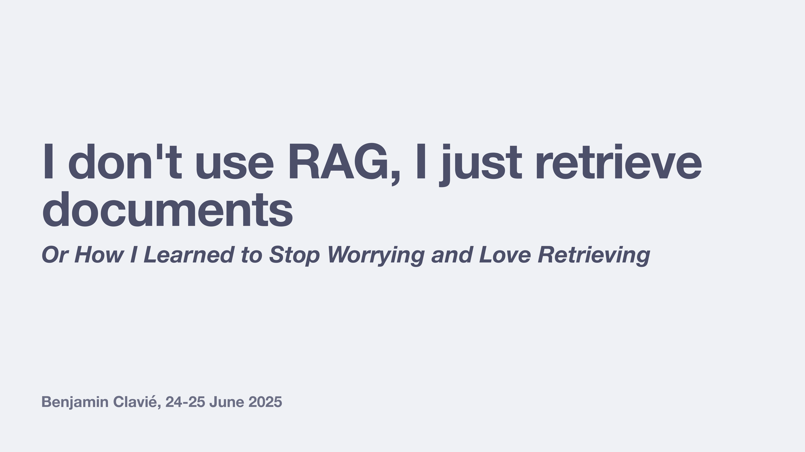

*([Timestamp: 00:00:00](https://youtu.be/Evlk9J-B_uc?t=0s){target="_blank"})*

The cheeky title of the talk.

*([Timestamp: 00:01:08](https://youtu.be/Evlk9J-B_uc?t=68s){target="_blank"})*

Ben introduces himself, noting his base in Musashino City, Japan (home of the Ghibli Museum). He currently does ML R&D at Answer.AI. He jokes about his widely-circulated profile picture, which he dubs "The Monopicture," a single photo from five years ago that has taken on a life of its own. He also mentions his recent work on ModernBERT and niceties related to ColBERT, which he promises to discuss later.

*([Timestamp: 00:02:05](https://youtu.be/Evlk9J-B_uc?t=125s){target="_blank"})*

Ben discusses the controversial idea that "RAG is dead." Ben explains that the statement only applies to a very narrow, and often misunderstood, definition of RAG that was popularized by marketing efforts.

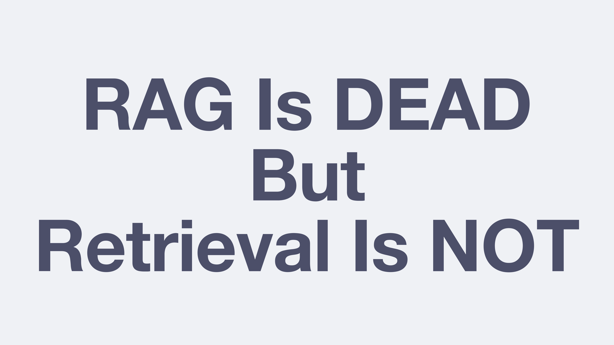

*([Timestamp: 00:02:33](https://youtu.be/Evlk9J-B_uc?t=153s){target="_blank"})*

The "RAG" that many people came to know in 2023: simplistic, single-vector semantic search approach may be obsolete. However, the underlying concept of **retrieval** is still relevant.

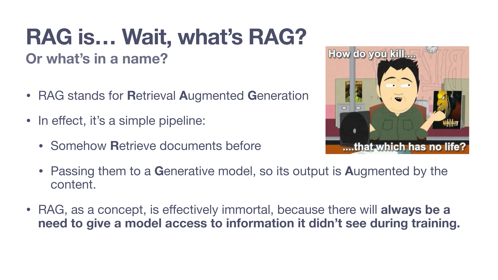

*([Timestamp: 00:02:45](https://youtu.be/Evlk9J-B_uc?t=165s){target="_blank"})*

Ben breaks down the acronym: **R**etrieval **A**ugmented **G**eneration. He points out that the original RAG paper actually described a process quite different from today's common interpretation, but the name stuck. At its core, the pipeline is simple: you **somehow** retrieve documents and pass them to a generative model to **augment** its output. He argues that there will always be a need to provide models with external information they weren't trained on.

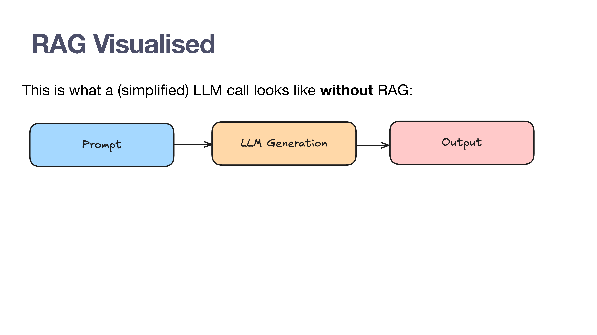

*([Timestamp: 00:04:08](https://youtu.be/Evlk9J-B_uc?t=248s){target="_blank"})*

This slide presents a standard, simplified LLM call: a prompt goes in, the LLM generates a response, and an output comes out. This is the baseline for understanding how RAG changes the process.

*([Timestamp: 00:04:28](https://youtu.be/Evlk9J-B_uc?t=268s){target="_blank"})*

With RAG, a new step is inserted: "Context Documents." Ben emphasizes that the "how" of retrieving these documents doesn't matter for the definition. If you've added external documents to the context window to augment the generation, you're doing RAG. Even manually copy-pasting text into a prompt is, technically, a form of RAG.

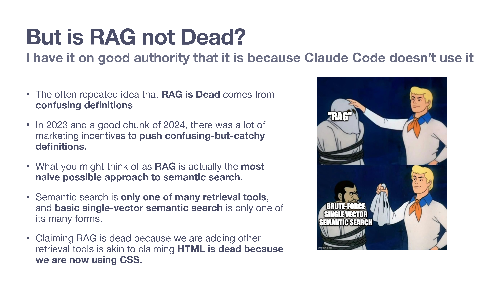

*([Timestamp: 00:05:10](https://youtu.be/Evlk9J-B_uc?t=310s){target="_blank"})*

Ben addresses the common argument that since tools like Claude Code don't use "RAG," RAG must be dead. What people often call "RAG" is a naive brute force, single-vector semantic search. This definition was pushed heavily by marketing in 2023-2024 because it was simple to sell. Claiming RAG is dead because we're now using better retrieval tools is, in his words, "akin to claiming HTML is dead because we are now using CSS."

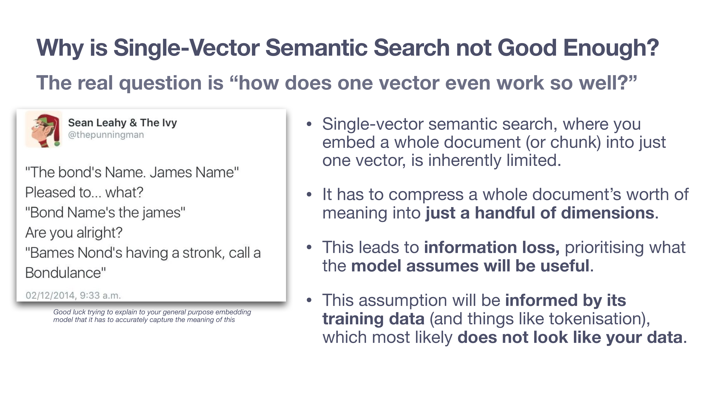

*([Timestamp: 00:06:46](https://youtu.be/Evlk9J-B_uc?t=406s){target="_blank"})*

Ben explains the limitations of single-vector search. It must compress the meaning of an entire document or chunk into a single, relatively small vector (e.g., ~1000 dimensions). This compression inevitably leads to information loss. The model is trained to prioritize information it assumes will be useful for matching queries to documents based on its training data (like Bing search data), which most likely does not look like your specific, domain-heavy data (e.g., a unique codebase). This mismatch is why general-purpose embedding models often struggle with specialized domains like code retrieval.

*([Timestamp: 00:09:45](https://youtu.be/Evlk9J-B_uc?t=585s){target="_blank"})*

Ben tackles the argument that massive context windows (e.g., Gemini's 1M or hypothetical 10M token windows) make RAG obsolete. He uses an analogy: it's like someone in 1999 claiming hard drives are dead because 512MB RAM sticks are coming soon. The reality is that even 10M tokens is a small amount of space for many enterprise knowledge bases or large datasets. Furthermore, the cost and inefficiency of stuffing everything into the context for every query makes it impractical.

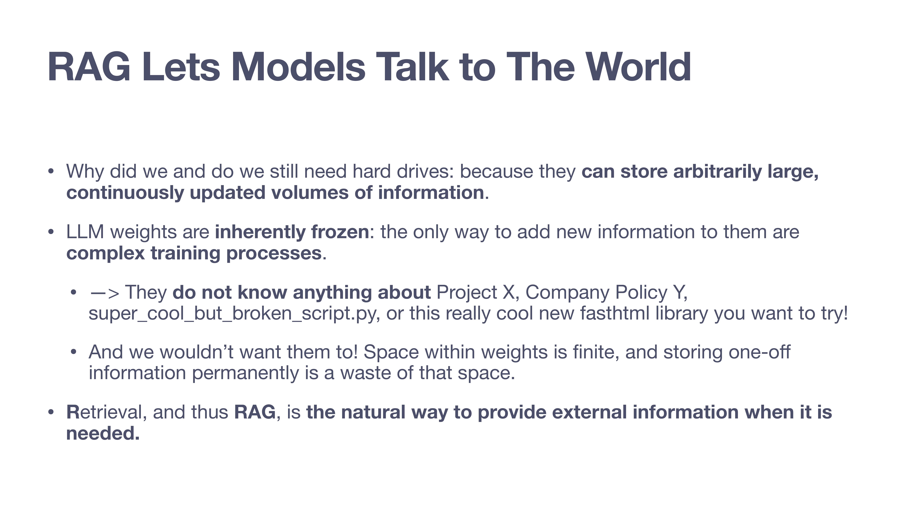

*([Timestamp: 00:12:15](https://youtu.be/Evlk9J-B_uc?t=735s){target="_blank"})*

Retrieval is never going away. LLM weights are frozen at a point in time. They don't know about your new internal project, your updated company policy, or that "really cool new [fasthtml](https://www.fastht.ml/) library you want to try." Training a model on every new piece of information is complex and inefficient. Ben argues we wouldn't want models to store all this one-off information permanently anyway; we want their finite weight space to be used for intelligence, not just knowledge storage. Retrieval is necessary to inject this external, up-to-date information.

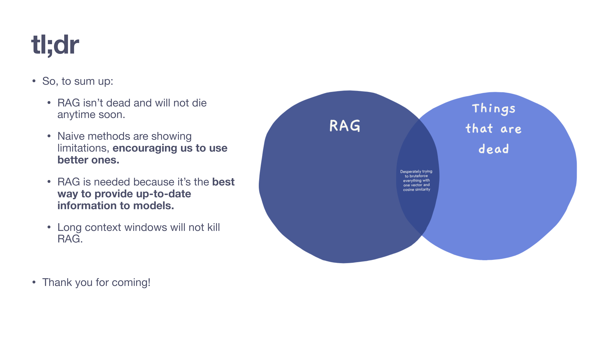

*([Timestamp: 00:14:32](https://youtu.be/Evlk9J-B_uc?t=872s){target="_blank"})*

Ben summarizes takeaways so far:
-   RAG isn't going away.
-   Naive methods (like basic cosine similarity) are showing their limits, pushing us toward better, more sophisticated retrieval techniques.
-   RAG is the best way to provide models with up-to-date information.
-   Long context windows are not a replacement for retrieval.
The Venn diagram illustrates that what's "dead" is the oversimplified idea of brute-forcing everything with a single vector, not RAG generally.

*([Timestamp: 00:15:31](https://youtu.be/Evlk9J-B_uc?t=931s){target="_blank"})*

Classic Ben - more surprises coming!

*([Timestamp: 00:15:52](https://youtu.be/Evlk9J-B_uc?t=952s){target="_blank"})*

There is more to discuss re: better retrieval methods.

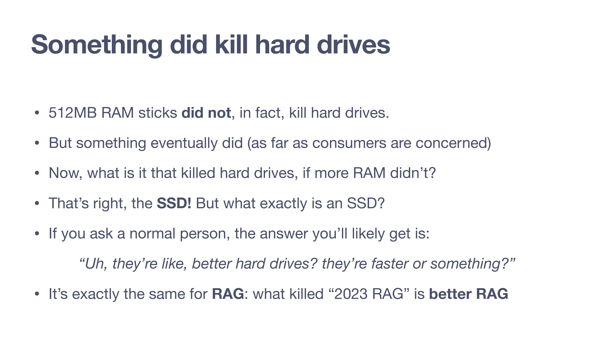

*([Timestamp: 00:15:54](https://youtu.be/Evlk9J-B_uc?t=954s){target="_blank"})*

Ben returns to his analogy. While more RAM didn't kill hard drives, SSDs did (for consumers). An SSD is just a "better hard drive." Similarly, what killed "2023 RAG" is simply **better RAG** (and concretely, better forms of retrieval).

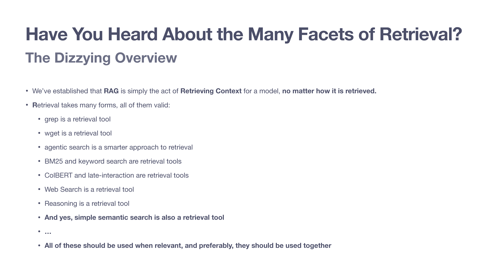

*([Timestamp: 00:17:03](https://youtu.be/Evlk9J-B_uc?t=1023s){target="_blank"})*

To showcase the breadth of retrieval, Ben lists a variety of tools: `grep`, `wget`, agentic search, `BM25`, `ColBERT`, web search, and even reasoning. These are all valid retrieval methods. **The best approach often involves using them in combination.**

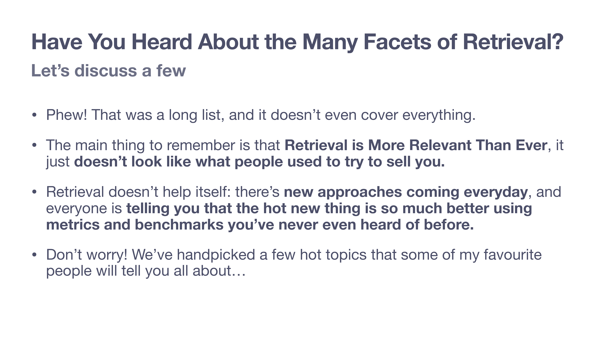

*([Timestamp: 00:18:20](https://youtu.be/Evlk9J-B_uc?t=1100s){target="_blank"})*

Ben acknowledges the overwhelming landscape of retrieval techniques. It's no longer the simple, one-trick pony it was once marketed as. To help navigate this, he introduces the upcoming speakers who will cover specific "hot topics."

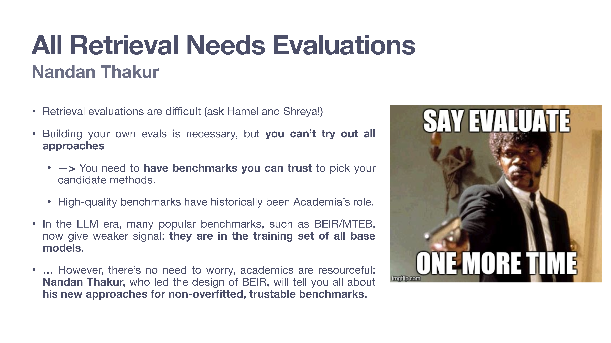

*([Timestamp: 00:19:34](https://youtu.be/Evlk9J-B_uc?t=1174s){target="_blank"})*

The first guest expert introduced is [Nandan Thakur](https://maven.com/p/fae749/modern-ir-evaluation-in-the-generative-rag-era){target="_blank"}. With thousands of retrieval approaches available, trustworthy benchmarks are important. However, popular benchmarks like BEIR and MTEB are now part of the training data for all base models, leading to data contamination and giving a weaker signal. Nandan, who led the design of BEIR, will discuss his new approaches to creating non-overfitted, trustable benchmarks, such as the continuously updated `FreshStack`.

*([Timestamp: 00:21:15](https://youtu.be/Evlk9J-B_uc?t=1275s){target="_blank"})*

Next up is [Orion Weller](https://maven.com/p/d6c44b/reasoning-opens-up-new-retrieval-frontiers){target="_blank"}, who researches the intersection of reasoning and retrieval. How does retrieval fit into a world where models can "ramble on about their thoughts"? Orion will explore whether retrievers can think or use the reasoning of other models to improve performance.

*([Timestamp: 00:22:24](https://youtu.be/Evlk9J-B_uc?t=1344s){target="_blank"})*

[Antoine Chaffin](https://maven.com/p/1973fe/going-further-late-interaction-beats-single-vector-limits){target="_blank"} will discuss late-interaction and multi-vector models like ColBERT. These models address the information loss of single-vector methods by using a vector for each token. Antoine will explain how they work and introduce his work on `ColPali` to make these powerful models easy to use.

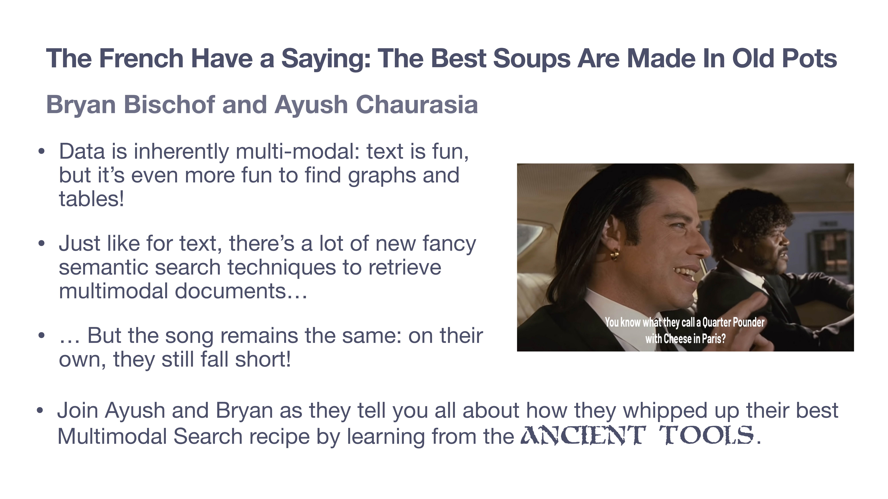

*([Timestamp: 00:23:39](https://youtu.be/Evlk9J-B_uc?t=1419s){target="_blank"})*

The final talk features [Bryan Bischof and Ayush Chaurasia](https://maven.com/p/f9eb59/the-map-is-not-the-territory-highly-multimodal-search){target="_blank"} on multimodal search. They'll explain that for multimodal data like graphs and tables, naive semantic search alone is insufficient. They will share how they created their best multimodal search recipe by combining modern techniques with "ancient tools."

*([Timestamp: 00:24:54](https://youtu.be/Evlk9J-B_uc?t=1494s){target="_blank"})*

You can sign up for the series with the links above, or here: [p2: Evals](https://maven.com/p/fae749/modern-ir-evaluation-in-the-generative-rag-era){target="_blank"}, [p3: Reasoning](https://maven.com/p/d6c44b/reasoning-opens-up-new-retrieval-frontiers){target="_blank"}, [p4: Late-Interaction](https://maven.com/p/1973fe/going-further-late-interaction-beats-single-vector-limits){target="_blank"}, and [p5: Multimodal](https://maven.com/p/f9eb59/the-map-is-not-the-territory-highly-multimodal-search){target="_blank"}.

---

 
<strong>👉 <em>We are teaching our last and final cohort of our [AI Evals course](https://bit.ly/evals-ai){target="_blank"} next month</strong> (we have to get back to building). Here is a [35% discount code](https://bit.ly/evals-ai){target="_blank"} for readers of this post.</em> 👈

## Video

Here is the full video:

