As part of our [LLM Evals course](https://bit.ly/evals-ai), I hosted [Nandan Thakur](https://thakur-nandan.github.io/){target="_blank"} for the second part of our 5-part mini-series on evaluating and optimizing RAG. Nandan is a researcher at the University of Waterloo and a key contributor to major Information Retrieval (IR) benchmarks, including BEIR and the new FreshStack. His talk explains why traditional IR evals designed for search engines may be insufficient for RAG systems. He argues that LLM-generated answers often carry different retrieval goals which necessitate different IR metrics.

Below is an annotated version of his presentation, with timestamped links for each slide.

 
<strong>👉 <em>We are teaching our last and final cohort of our [AI Evals course](https://bit.ly/evals-ai) next month</strong> (we have to get back to building). Here is a [35% discount code](https://bit.ly/evals-ai) for readers of this post.</em> 👈

## Annotated Presentation

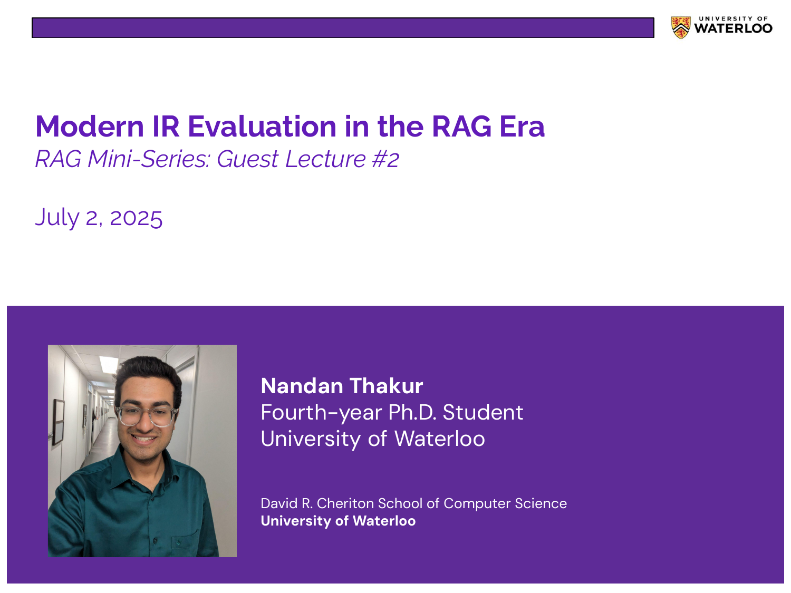

*([Timestamp: 00:00:00](https://www.youtube.com/watch?v=Trps2swgeOg&t=0s))*

The title slide for Nandan's talk, "Modern IR Evaluation in the RAG Era."

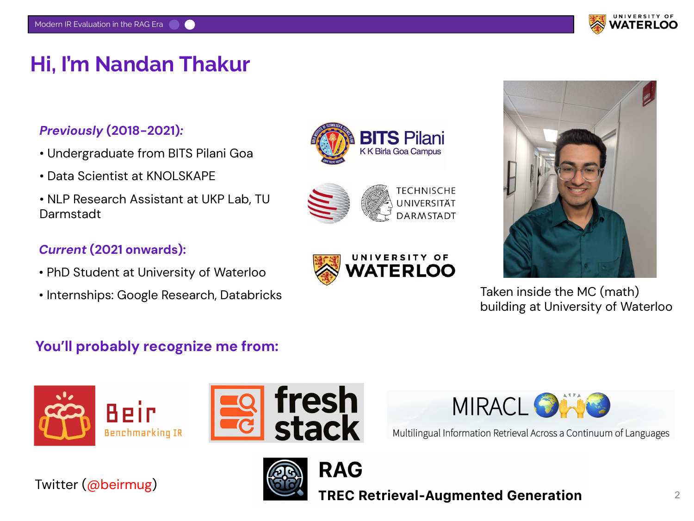

*([Timestamp: 00:00:14](https://www.youtube.com/watch?v=Trps2swgeOg&t=14s))*

Nandan introduces himself as a fourth-year Ph.D. student at the University of Waterloo. He outlines his background, including research at UKP-TU and internships at Google Research and Databricks. He highlights his work on the BEIR, MIRACL, and FreshStack benchmarks, and the TREC RAG track.

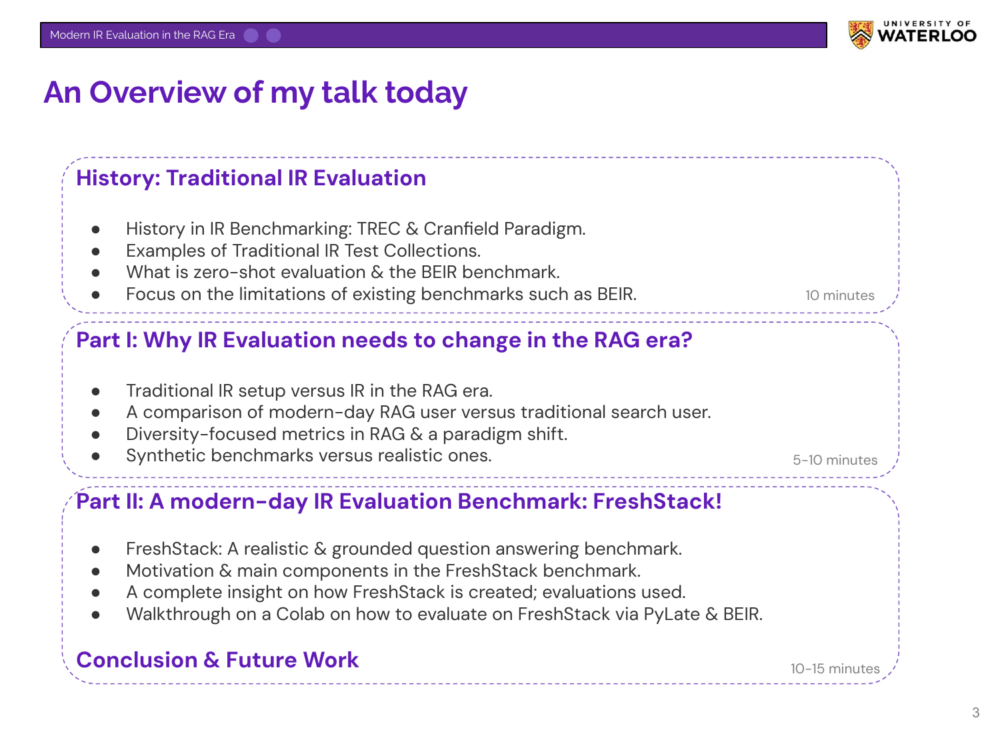

*([Timestamp: 00:01:09](https://www.youtube.com/watch?v=Trps2swgeOg&t=69s))*

Nandan outlines the presentation's three parts: a history of traditional IR evaluation, an explanation of why evaluation needs to change for RAG, and a deep dive into the FreshStack benchmark as a modern solution.

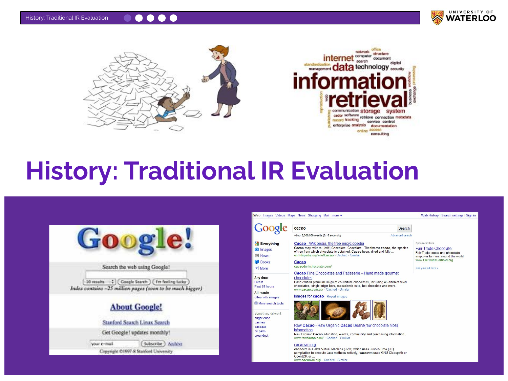

*([Timestamp: 00:01:45](https://www.youtube.com/watch?v=Trps2swgeOg&t=105s))*

This slide provides historical context. While RAG is new, Information Retrieval is a field with over 60 years of history. The slide contrasts an early Google interface with a modern one to show the evolution of web search.

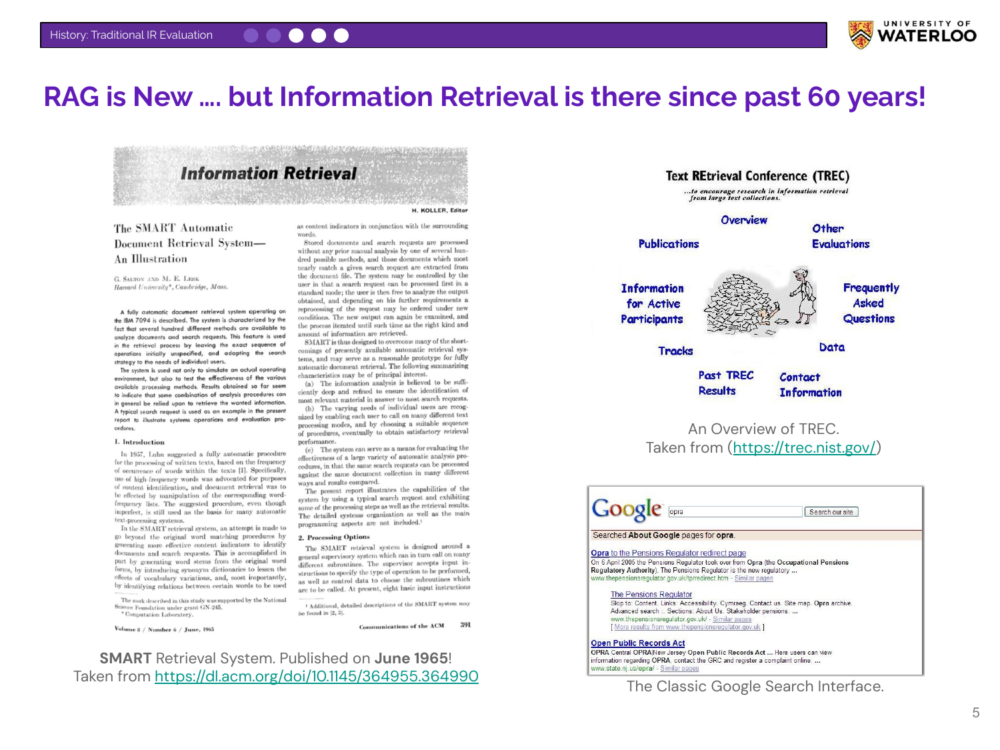

*([Timestamp: 00:01:50](https://www.youtube.com/watch?v=Trps2swgeOg&t=110s))*

Nandan emphasizes IR's history by showing a 1965 paper on the SMART Retrieval System, an early automated document retrieval system. He also introduces the Text Retrieval Conference (TREC), an influential conference since the 1990s that continues to produce IR benchmarks and standards.

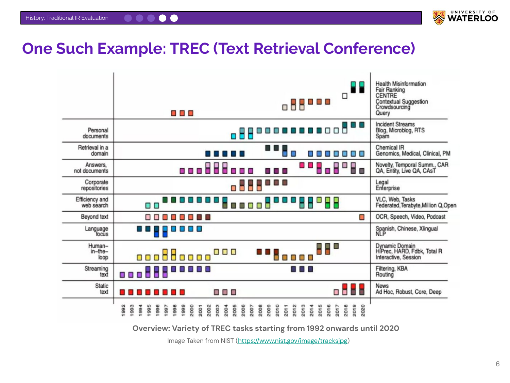

*([Timestamp: 00:03:00](https://www.youtube.com/watch?v=Trps2swgeOg&t=180s))*

A diagram from NIST illustrates the breadth of TREC's evaluation tasks from 1992 to 2020. These tracks range from classic ad-hoc retrieval to specialized areas like multilingual search and human-in-the-loop evaluation, demonstrating the field's ongoing evolution.

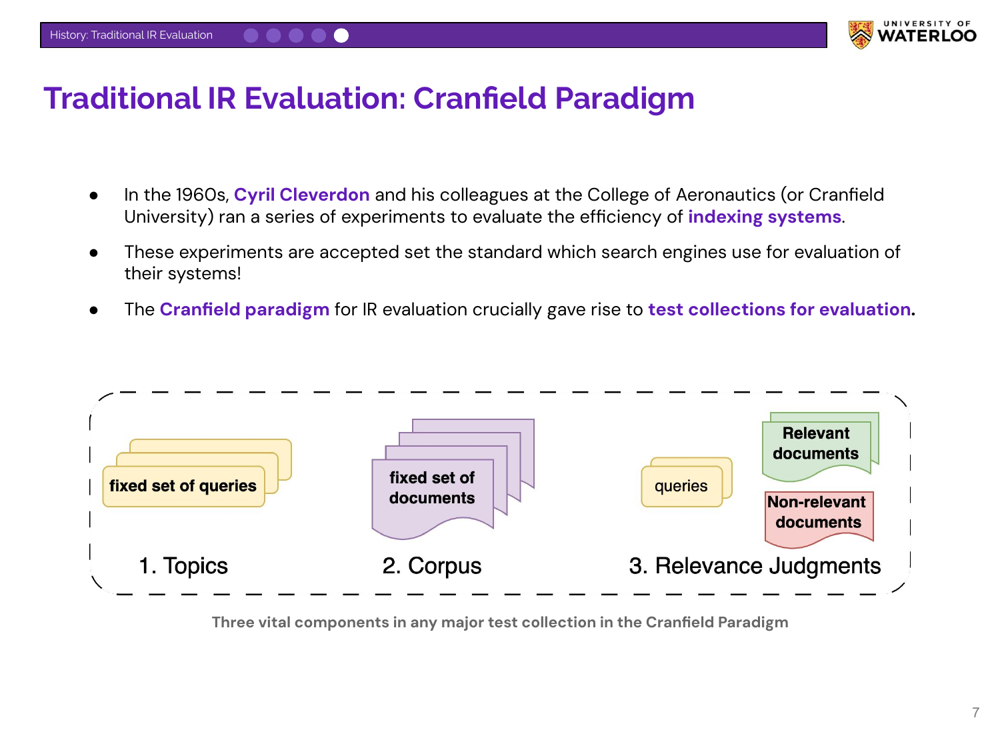

*([Timestamp: 00:03:54](https://www.youtube.com/watch?v=Trps2swgeOg&t=234s))*

Nandan introduces the **Cranfield Paradigm**, the foundation of traditional IR evaluation developed in the 1960s. It established the concept of a **test collection**, comprising three components:

1.  **Topics:** A fixed set of user queries.
2.  **Corpus:** A fixed collection of documents.
3.  **Relevance Judgments:** Human-annotated labels indicating which documents are relevant to which queries.

This three-part structure remains the basis for most IR benchmarks today.

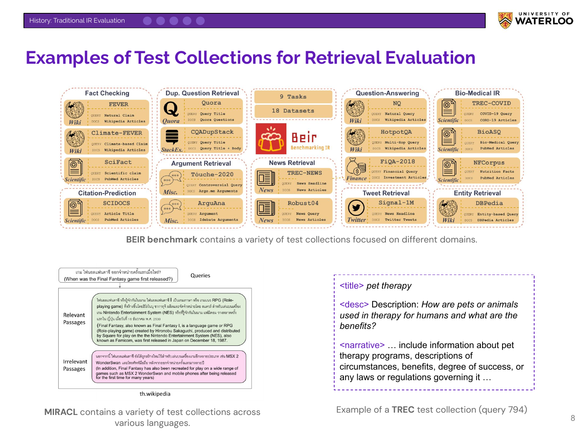

*([Timestamp: 00:06:00](https://www.youtube.com/watch?v=Trps2swgeOg&t=360s))*

Nandan shows examples of modern test collections. He highlights **BEIR** for its diversity of tasks, **MIRACL** for multilingual retrieval, and the typical **TREC** query structure, which includes a `title`, `description`, and detailed `narrative`.

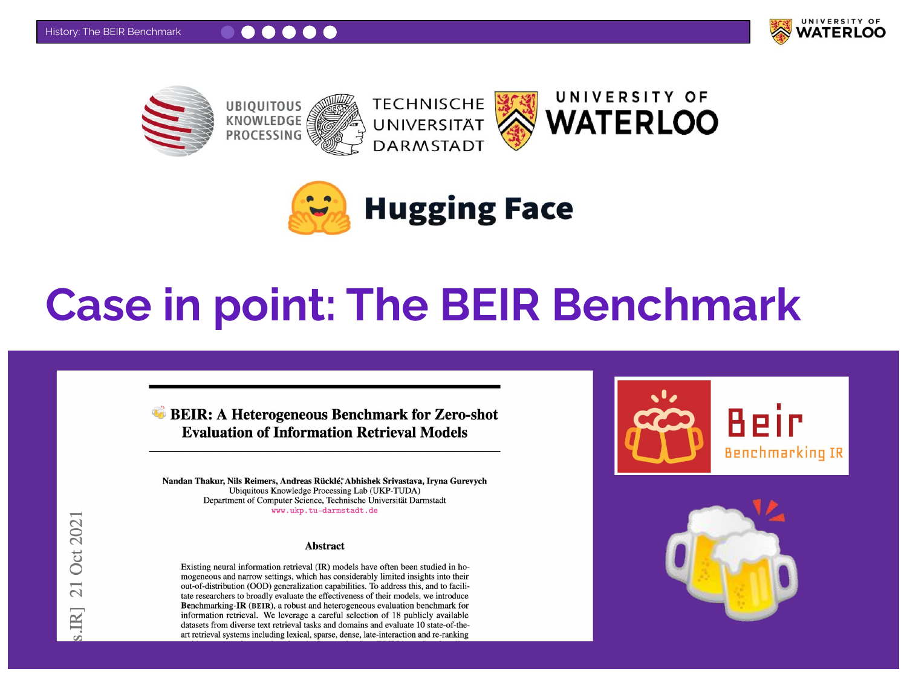

*([Timestamp: 00:07:20](https://www.youtube.com/watch?v=Trps2swgeOg&t=440s))*

This slide introduces the BEIR (Benchmarking-IR) benchmark, which was among the first to popularize zero-shot evaluation for retrieval models.

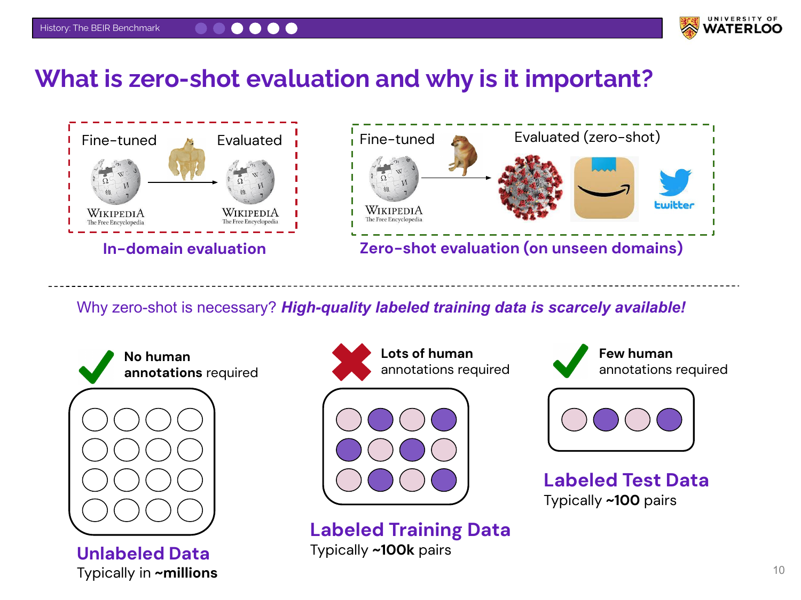

*([Timestamp: 00:07:38](https://www.youtube.com/watch?v=Trps2swgeOg&t=458s))*

Nandan explains **zero-shot evaluation**, where a model is tested on a domain or task it has not seen during training. This contrasts with *in-domain* evaluation (training and testing on similar data). Zero-shot evaluation is more realistic because high-quality, labeled training data for niche use cases is scarce and expensive to create.

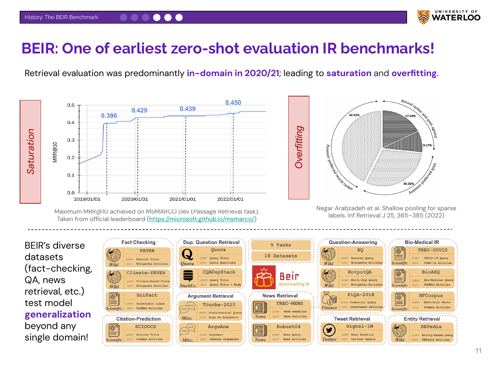

*([Timestamp: 00:10:09](https://www.youtube.com/watch?v=Trps2swgeOg&t=609s))*

Nandan explains the motivation for BEIR. Around 2020-2021, the field focused heavily on the MSMARCO dataset, leading to **saturation** (performance plateaus) and **overfitting**. BEIR was created to combat this by providing a diverse set of datasets to test a model's generalization ability beyond a single domain.

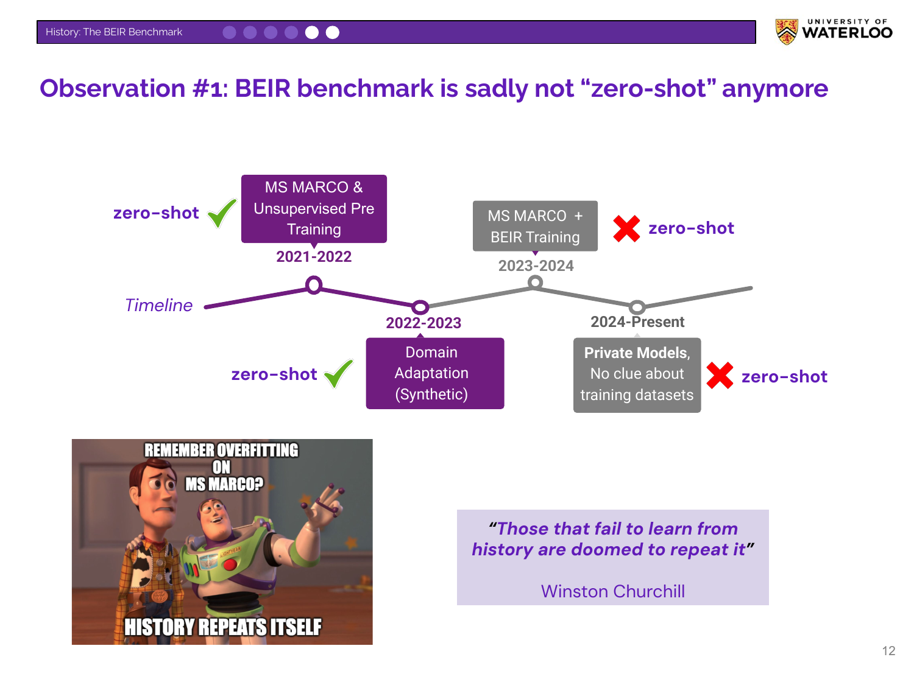

*([Timestamp: 00:11:10](https://www.youtube.com/watch?v=Trps2swgeOg&t=670s))*

Nandan explains that BEIR is no longer a truly "zero-shot" benchmark. Researchers now often include BEIR's training sets in their model development pipelines. This, along with private models using unknown training data, repeats the overfitting problem that BEIR was designed to solve.

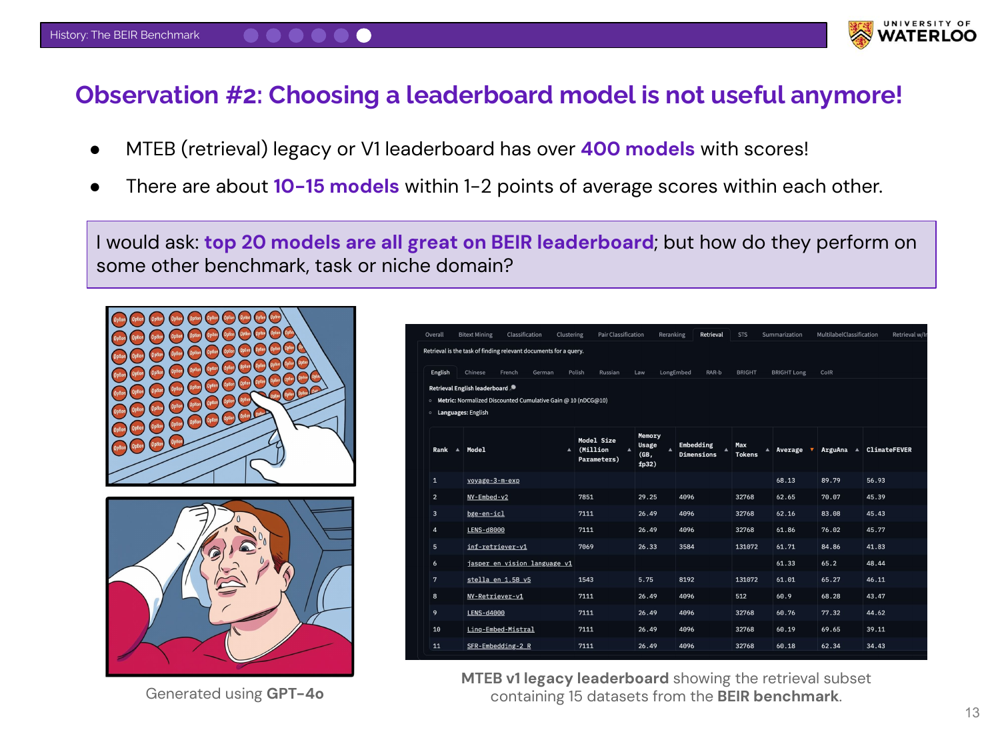

*([Timestamp: 00:13:20](https://www.youtube.com/watch?v=Trps2swgeOg&t=800s))*

Nandan highlights a practical issue: leaderboards are now too crowded to be useful. The MTEB leaderboard contains over 400 models, with the top contenders separated by marginal scores. This makes it difficult for practitioners to select a model and raises the question of how these models perform on other, more specialized tasks.

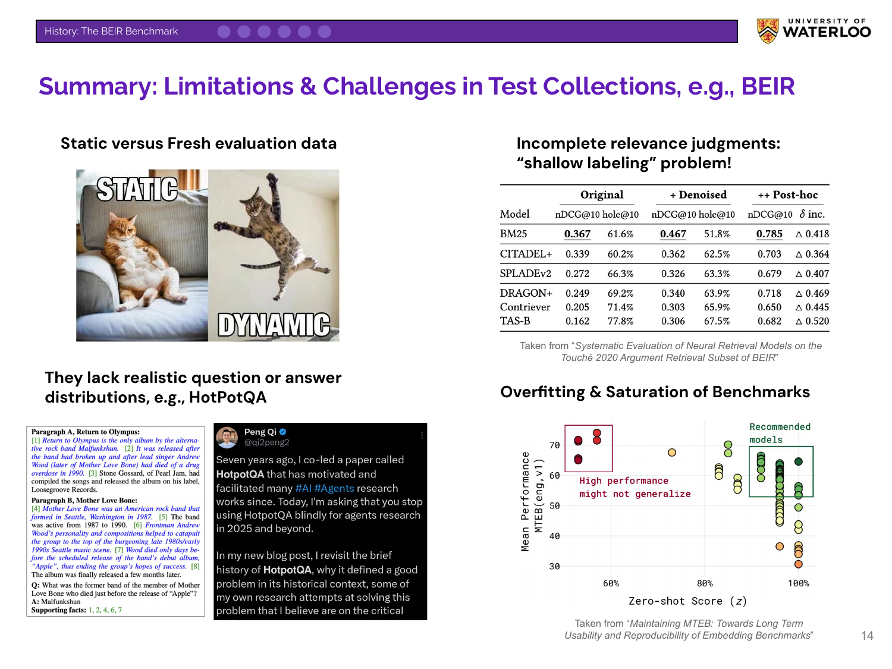

*([Timestamp: 00:14:43](https://www.youtube.com/watch?v=Trps2swgeOg&t=883s))*

This slide summarizes the limitations of existing test collections like BEIR. They are often static, leading to data contamination risk. They can suffer from incomplete "shallow labeling" from human annotators. They may also lack realistic question distributions, prompting even the creators of benchmarks like HotpotQA to advise against their use for modern agentic systems.

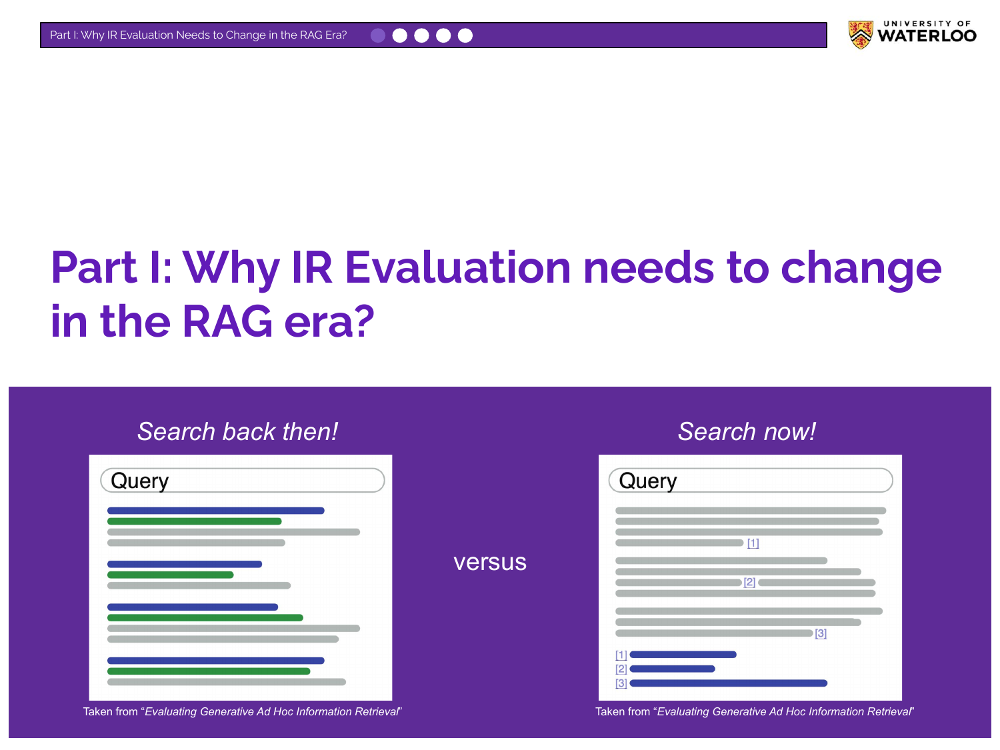

*([Timestamp: 00:17:28](https://www.youtube.com/watch?v=Trps2swgeOg&t=1048s))*

Nandan contrasts the old and new search paradigms. "Search back then" shows a ranked list of links, while "Search now" shows a generated answer block with citations, characteristic of RAG systems.

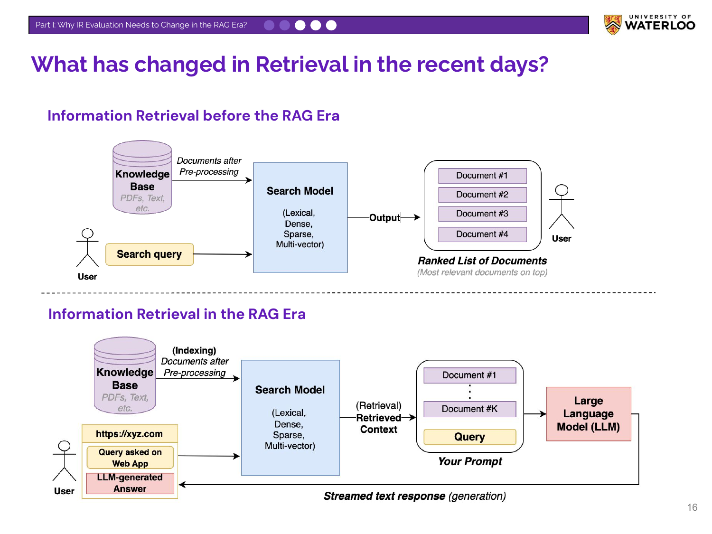

*([Timestamp: 00:18:20](https://www.youtube.com/watch?v=Trps2swgeOg&t=1100s))*

This slide diagrams the architectural shift. Before RAG, a search model returned a ranked list of documents to the user. In the RAG era, the search model provides retrieved documents as context to an LLM, which then generates a response for the user.

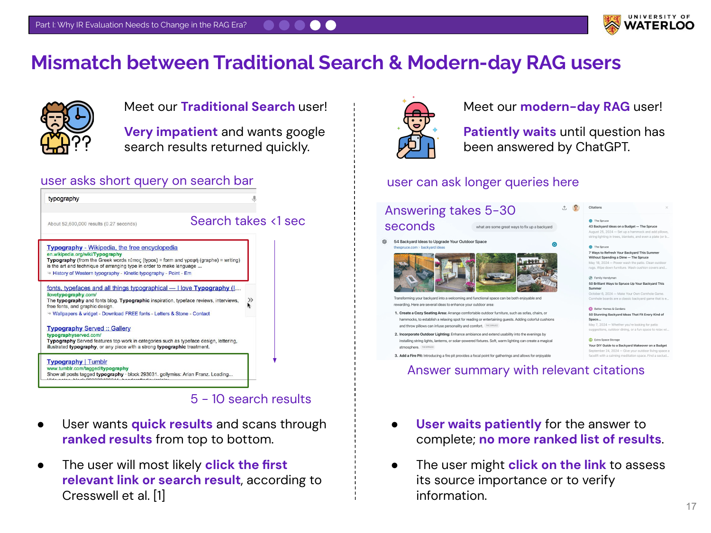

*([Timestamp: 00:19:10](https://www.youtube.com/watch?v=Trps2swgeOg&t=1150s))*

Nandan contrasts the two user types. A traditional search user is impatient, asks short queries, and scans a ranked list to click the first relevant link. A modern RAG user is patient, asks longer queries, and waits for a synthesized summary with citations, which they may use for verification.

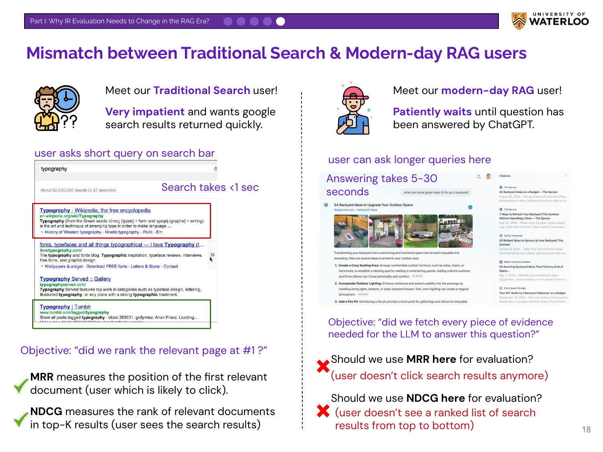

*([Timestamp: 00:21:08](https://www.youtube.com/watch?v=Trps2swgeOg&t=1268s))*

This slide presents the talk's central argument. Traditional metrics like **MRR** (Mean Reciprocal Rank) and **NDCG** (Normalized Discounted Cumulative Gain) were designed for the traditional objective: "Did we rank the relevant page at #1?" The new RAG objective is: "Did we fetch *every piece of evidence* needed for the LLM to answer this question?" For this new goal, MRR and NDCG may be insufficient on their own, as they do not measure comprehensive evidence collection or redundancy (more on that later).

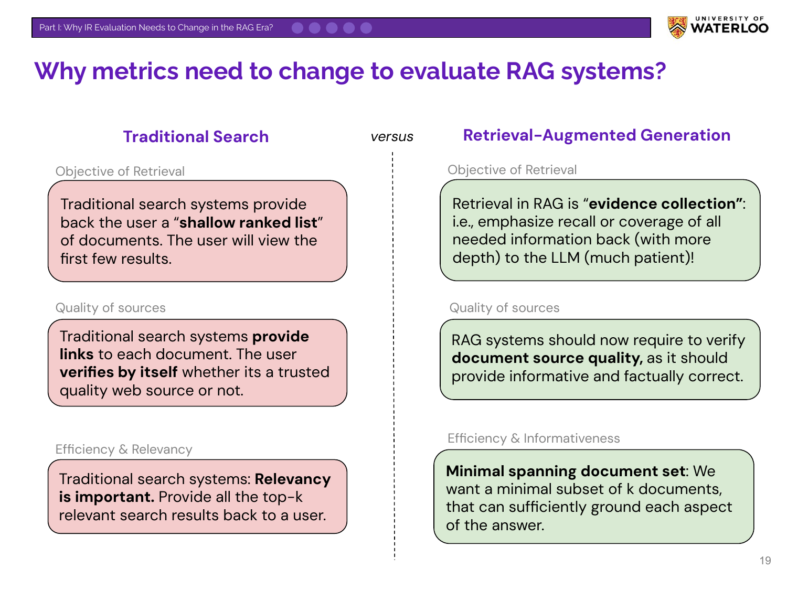

*([Timestamp: 00:23:20](https://www.youtube.com/watch?v=Trps2swgeOg&t=1400s))*

The argument is not to discard traditional relevance but to expand the evaluation criteria for RAG. While **Relevancy is [still] important**, it must now be balanced with new goals like finding a **minimal spanning document set**. This concept captures the need for a set of documents that is not only relevant but also comprehensively covers all aspects of an answer without being redundant.

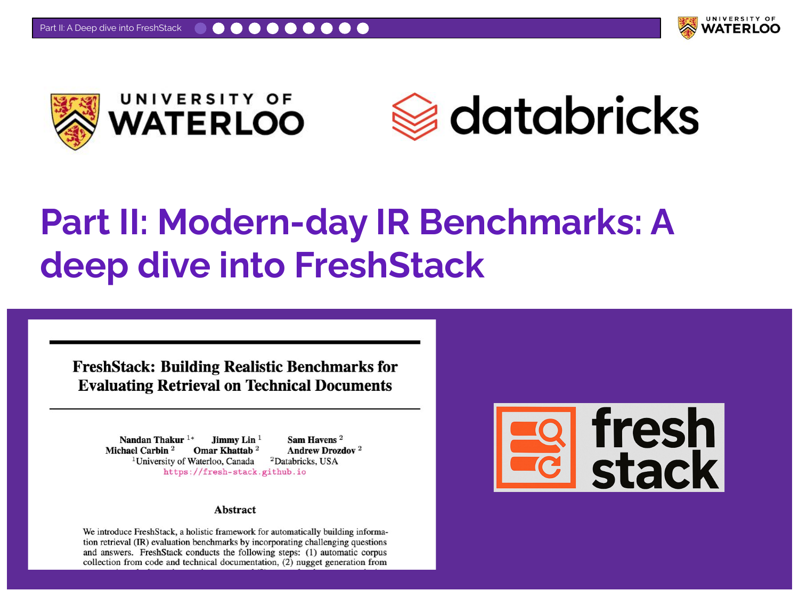

*([Timestamp: 00:24:50](https://www.youtube.com/watch?v=Trps2swgeOg&t=1490s))*

Nandan introduces **FreshStack**, a modern IR benchmark developed with Databricks. It is designed to evaluate retrieval for RAG on technical documents.

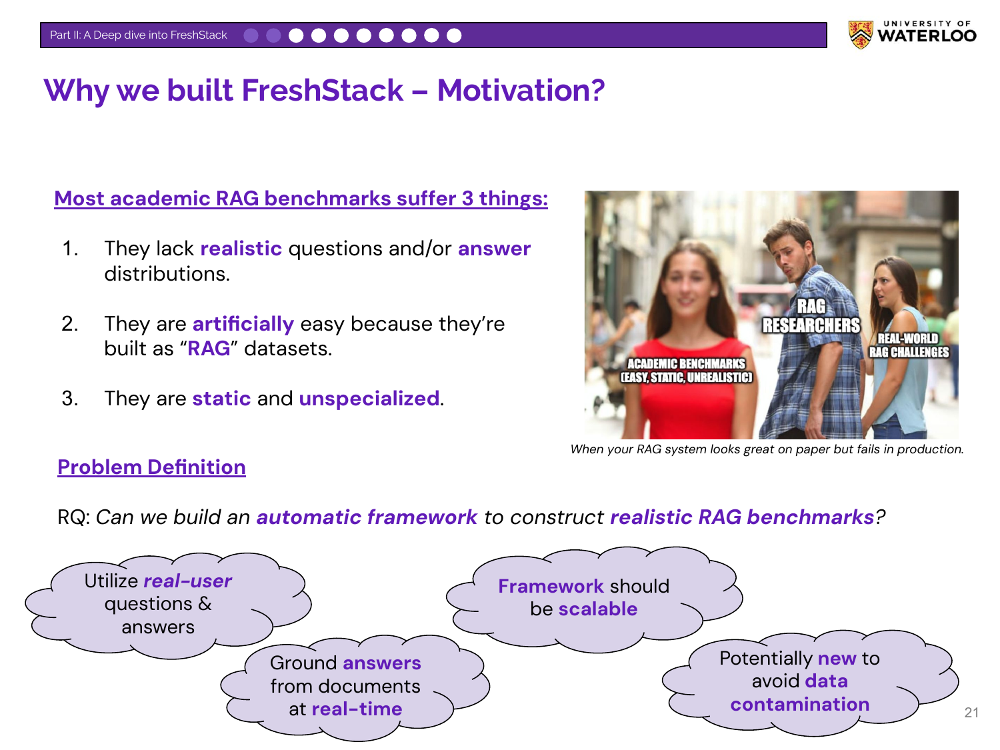

*([Timestamp: 00:25:00](https://www.youtube.com/watch?v=Trps2swgeOg&t=1500s))*

The motivation for FreshStack was to create a realistic RAG benchmark that overcomes the limitations of existing academic benchmarks, which are often static and artificially easy. The framework was designed to use real user questions, ground answers in real-time documents, be scalable, and be new to avoid data contamination.

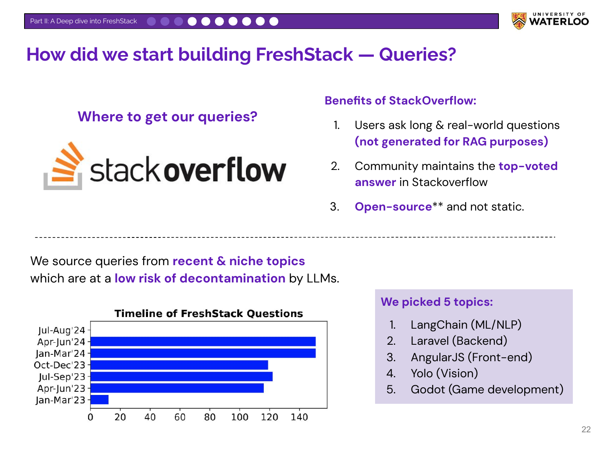

*([Timestamp: 00:26:16](https://www.youtube.com/watch?v=Trps2swgeOg&t=1576s))*

FreshStack sources its queries from **Stack Overflow**, an ideal source for long, complex, real-world questions with community-vetted answers. To mitigate data contamination, the benchmark uses questions from five recent and niche topics asked primarily in 2023 and 2024.

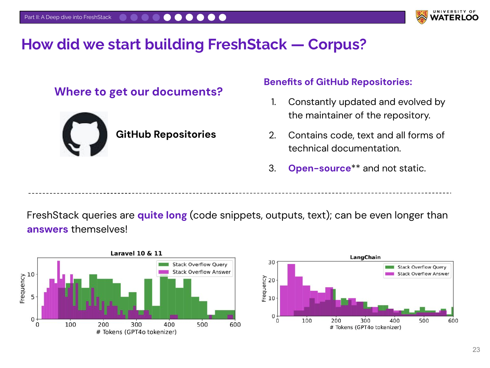

*([Timestamp: 00:27:30](https://www.youtube.com/watch?v=Trps2swgeOg&t=1650s))*

The document corpus comes from the **GitHub Repositories** of the corresponding topics. This provides a constantly updated source of technical documentation and code. An interesting finding is that for technical queries, the questions can be significantly longer than the answers.

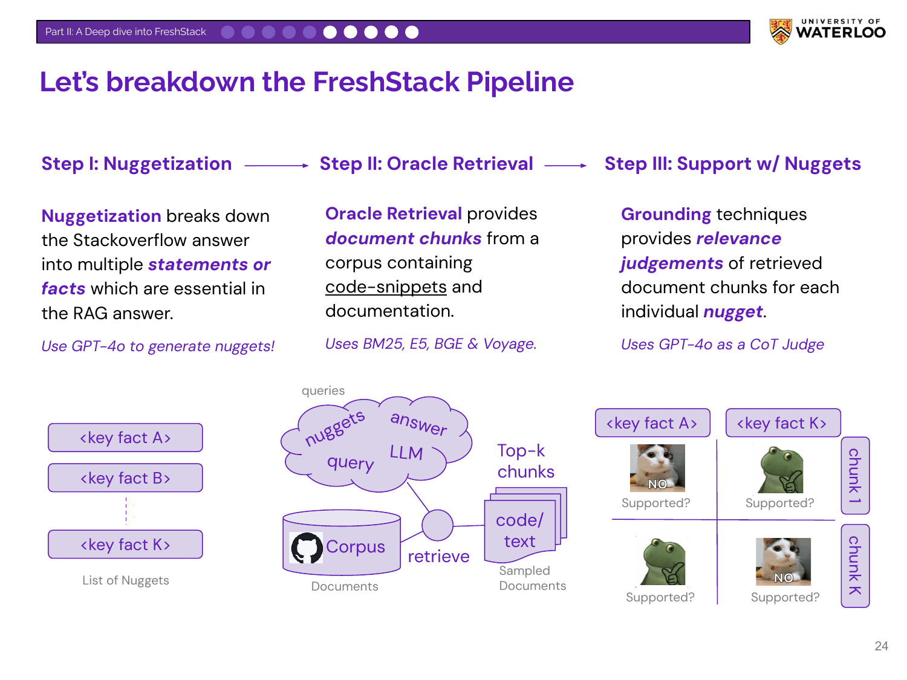

*([Timestamp: 00:28:18](https://www.youtube.com/watch?v=Trps2swgeOg&t=1698s))*

Nandan explains the three-step automated pipeline for building FreshStack:

1.  **Nuggetization:** A Stack Overflow answer is broken down by GPT-4o into essential, atomic facts or "nuggets."
2.  **Oracle Retrieval:** A diverse pool of candidate documents is retrieved from the corpus using a hybrid of models.
3.  **Support w/ Nuggets:** A GPT-4o judge checks which retrieved document chunks support each individual nugget, creating fine-grained relevance judgments.

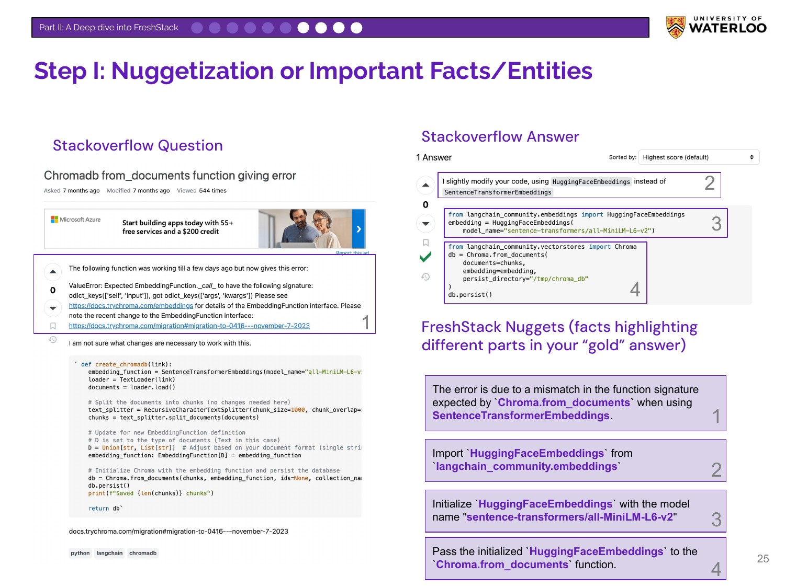

*([Timestamp: 00:29:50](https://www.youtube.com/watch?v=Trps2swgeOg&t=1790s))*

This slide shows a concrete example of nuggetization. An answer to a `Chroma.from_documents` error is broken down into four key facts: the cause of the error, the required import, the initialization step, and the function call.

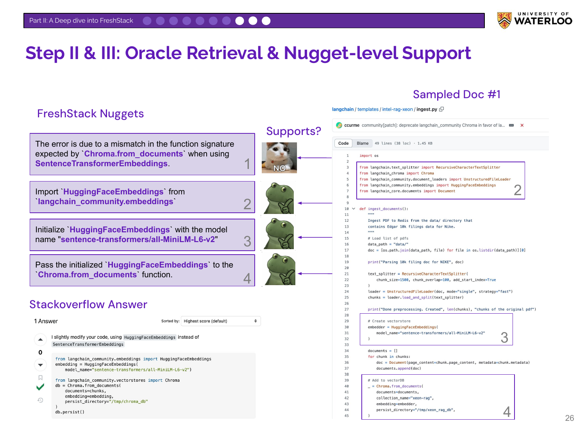

*([Timestamp: 00:30:50](https://www.youtube.com/watch?v=Trps2swgeOg&t=1850s))*

This slide illustrates the final steps. After a document is retrieved, the system checks which of the four nuggets it supports. This process creates nugget-level relevance labels, forming the basis for the new evaluation metrics.

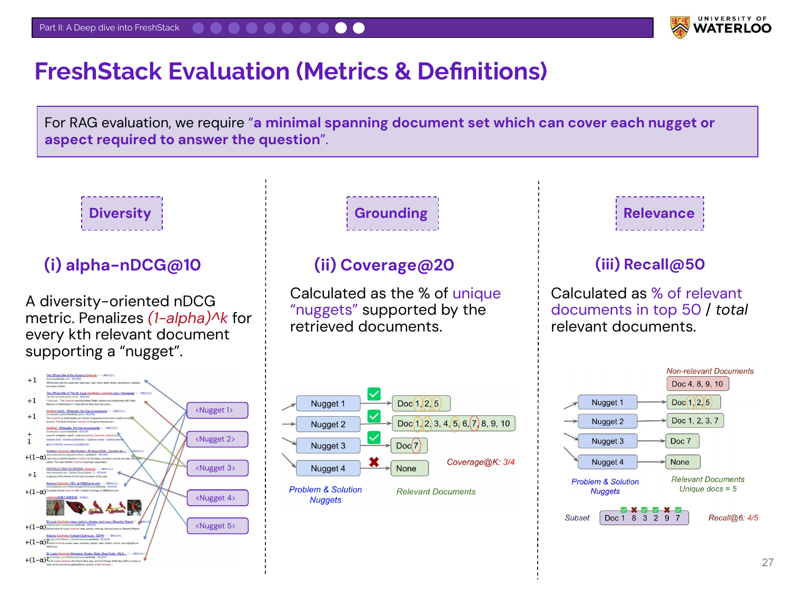

*([Timestamp: 00:31:26](https://www.youtube.com/watch?v=Trps2swgeOg&t=1886s))*

Nandan introduces the three metrics used in FreshStack, which provide a holistic view of RAG retrieval performance (for this specific use case):

1.  **Diversity (alpha-nDCG@10):** Measures non-redundancy, penalizing the retrieval of multiple documents that support the same fact.
2.  **Grounding (Coverage@20):** Measures the percentage of unique nuggets supported by the retrieved documents, directly evaluating evidence collection.
3.  **Relevance (Recall@50):** A traditional metric that serves as a foundational check on whether the retrieved documents are on-topic.
This multi-faceted approach augments traditional relevance with metrics tailored to the specific goals of RAG.

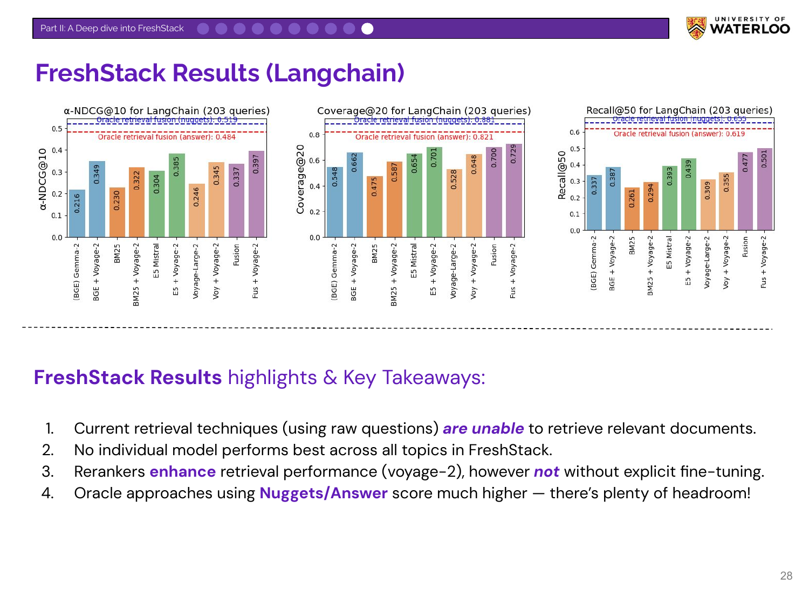

*([Timestamp: 00:33:19](https://www.youtube.com/watch?v=Trps2swgeOg&t=1999s))*

Nandan presents results from the benchmark. Key findings include that current retrieval techniques struggle on these realistic tasks, and no single model performs best across all topics. The large gap between current model performance and the theoretical "Oracle" maximum indicates significant room for improvement.

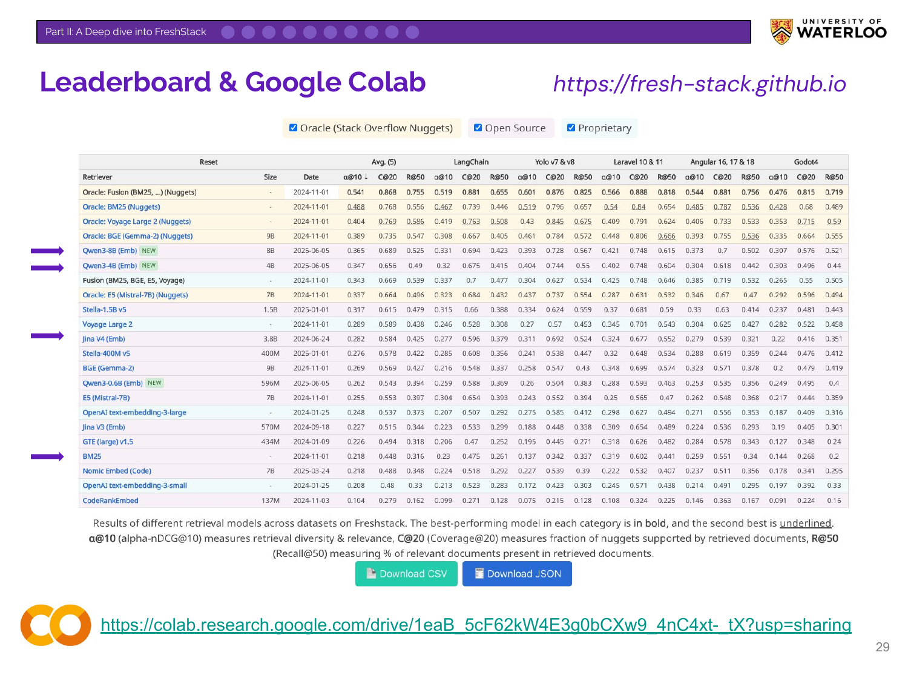

*([Timestamp: 00:34:55](https://www.youtube.com/watch?v=Trps2swgeOg&t=2095s))*

Nandan shares the public FreshStack leaderboard and a Google Colab notebook. The notebook provides a script for users to evaluate their own models on FreshStack using its multi-dimensional metrics.

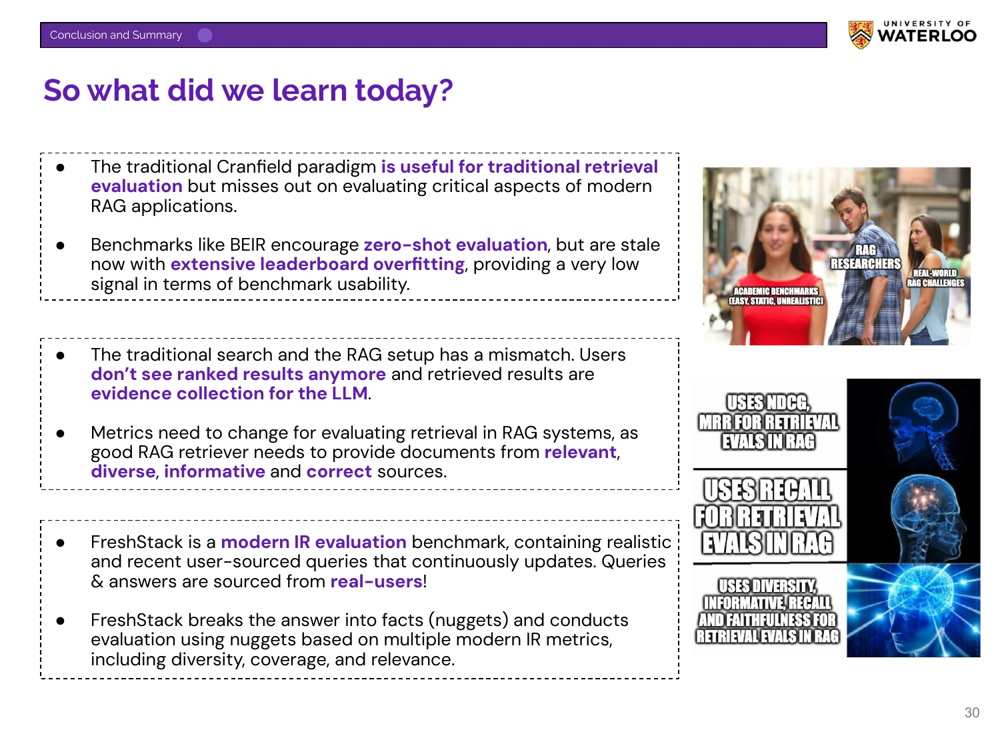

*([Timestamp: 00:36:01](https://www.youtube.com/watch?v=Trps2swgeOg&t=2161s))*

This slide summarizes the talk's main points. Traditional IR evaluation may be insufficient for RAG depending on the use case. Benchmarks like BEIR are now suffering from overfitting. Often, the goal of RAG retrieval is evidence collection, requiring metrics that evaluate diversity, informativeness, and correctness in addition to relevance.

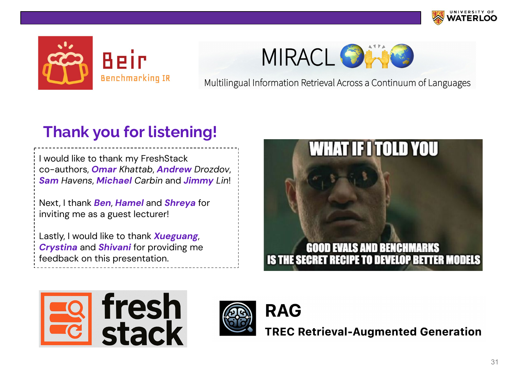

*([Timestamp: 00:37:15](https://www.youtube.com/watch?v=Trps2swgeOg&t=2235s))*

Nandan concludes by thanking his collaborators. The slide's meme reinforces his message: good evaluations are essential for developing better models.

---

## Reflections

Nandan's message was to consider other retrieval metrics beyond relevance based on your product's needs. He argued that we must sometimes reconsider what "good" retrieval means. For the stack overflow use case, he considered multiple dimensions of performance:

*   **Grounding (or Coverage):** Did the retrieval system fetch *all* the evidence needed to construct a complete and accurate answer? A missing fact can lead to an incomplete or incorrect generation, even if the retrieved documents are otherwise highly relevant.
*   **Diversity:** Are the retrieved documents efficiently informative? Retrieving multiple documents that repeat the same information is less valuable than retrieving a set of documents that each contribute a unique and essential fact.
*   **Relevance:** Is the retrieved information on-topic? This remains a fundamental check. A diverse and well-grounded set of documents is useless if it pertains to the wrong subject.

This is not a call to discard traditional metrics but to **augment** them. The FreshStack benchmark, with its blend of Recall, Coverage, and Diversity metrics, is an example of this.

## Q&A Session

*   **How well does FreshStack generalize outside of coding-related domains?**
    Nandan feels that FreshStack approach should generalize well outside of coding-related domains, but more experiments are needed. The pipeline of nuggetization, retrieval, and grounding can be applied to any domain with a corpus and question-answer pairs, allowing for the creation of a "FreshStack" for finance, law, or other areas.

*   **For domain-specific RAG, should people build their own evaluations mimicking this approach?**
    Yes, but the relative importance of each dimension (Diversity, Grounding, Relevance) depends on the use case. For patent search, recall is critical. For a comparative question, coverage of all viewpoints is important. Weighting thiese metrics into a combined score according to the product needs is a reasonable approach. 

*   **Does the FreshStack leaderboard align with intuitions about the best retrieval models?**
    The leaderboard shows that some popular proprietary models can underperform classic baselines like BM25 on this benchmark. It also highlights that recent open-source models (e.g., Qwen3, Stella) are now highly competitive with top closed-source offerings, and that performance does not always scale with model size.

*   **How does this evaluation framework interact with advanced retrieval methods?**
    The evaluation framework is method-agnostic. While current models on the leaderboard use single-step retrieval, more complex methods like multi-query decomposition or late-interaction models can be evaluated using the same principles. The final set of retrieved documents can still be measured for its diversity, coverage, and recall, regardless of how it was generated.

*   **What are you working on next?**
    Nandan is focusing on generating high-quality synthetic training data for RAG systems. He is also an organizer for the TREC RAG track, where he plans to introduce the diversity and grounding metrics from FreshStack to help push the community toward more robust evaluation standards.

---

 
<strong>👉 <em>We are teaching our last and final cohort of our [AI Evals course](https://bit.ly/evals-ai) next month</strong> (we have to get back to building). Here is a [35% discount code](https://bit.ly/evals-ai) for readers of this post.</em> 👈

## Video

Here is the full video:

